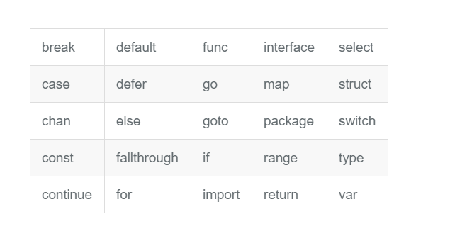
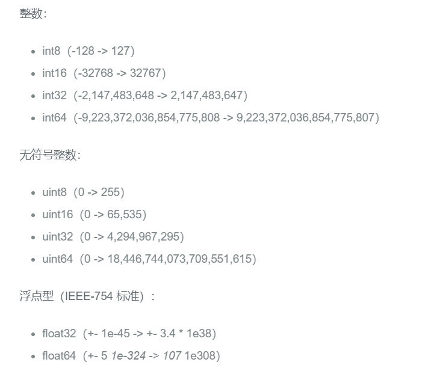
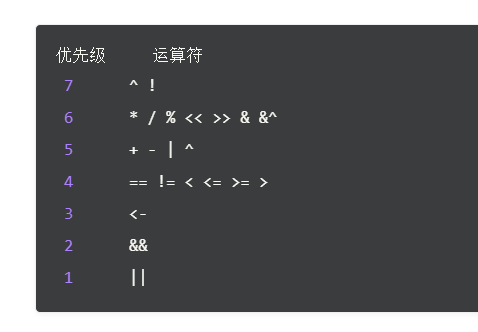

### 文件名、关键字和标识符

go 的源文件以 `.go`  为后缀名，文件名由多个部分组成，则使用下划线 `_` 进行分隔

`_` 是一个特殊的表示符，被称为空白标识符。可以像其他标识符那样用于变量的声明或赋值，但任何赋给这个标识符的值都将被抛弃，因此这些值不能再后续的代码中使用，也不可以使用这个标识符作为变量对其它变量进行赋值或运算。

go 的关键字：



保留字：


### 包的概念、导入和可见性

包是结构化代码的一种方式，每个程序都由包的概念组成，可以使用自身的包或者从其它包中导入内容。

每个 go 文件都属于且仅属于一个包。一个包可以由许多 `.go` 为扩展名的源文件组成，因此文件名和包名一般不相同。

必须在源文件中非注释的第一行指明这个文件属于哪个包，如：`package main` 表示一个可独立执行的程序，每个 go 应用程序都包含一个名为 `mian` 的包

Tips：**所有的包名都应该使用小写字母**

##### 标准库

在 Go 安装文件里包含一些可以直接使用的包，即标准库。

标准库的位置在 `$GOROOT\PKG\$GOODS_$GOARCH` 目录下

如果包名不是以 `.` 或 `/` 开头，如：`"fmt"`  或者 `"container/list"` ，则 go 会在全局文件进行查找

如果包名以 `./`  开头，则 go 会在相对目录中查找

如果包名以 `/` 开头，则会在系统的绝对路径查找

##### 可见性规则

当标识符（常量、变量、类型、函数名、结构字段等）以一个大写字母开头，如：`Group1` 那么使用这种形式的表示符的对象就可以被外部包的代码所使用，可以视作（public）；

当标识符以小写字母开头，则对包外是不可见的，但在整个包的内部是可见并可用的，可以视作（private）

包可以作为命名空间使用，避免包名冲突可以使用包的别名

```go
package main

import fm "fmt"

func main() {
    fm.Println("Hello world!")
}
```

> Tips：如果导入一个包却没有使用，则会在构建程序时引发错误，`import and not used：os`

##### 函数

定义函数的每个参数名称后面必须紧跟着该参数的类型

main 函数是每一个可执行程序所必须包含的，一般来说是在启动后第一个执行的函数（**如果有 init 函数则会先执行该函数**）

```go
func functionName(parameter_list) (return_value_list) {
   …
}
```

- parameter_list 形式为 (param1 type1,param2,type2)
- return_value_list 形式为 (ret1 type1,ret2 type2)

##### 注释

```go
package main

import "fmt" // Package implementing formatted I/O.

func main() {
   fmt.Printf("Καλημέρα κόσμε; or こんにちは 世界\n")
}
```

注释不会被编译，但可以通过 godoc 来使用

多行注释一般用于包的文档描述或注释成块的代码片段

每一个包都应该有相关的注释，在 package 语句之前的块注释将被默认认为这是包的文档说明

几乎所有全局作用域的类型、常量、变量、函数和被导出的对象都应该有一个合理的注释。函数注释需要以函数名开头：

```go
// abc ....
func abc() {
    ....
}
```

##### 类型

使用 var 声明的变量值会自动初始化为该类型的零值

基本类型：int、float、bool、string

结构化（复合）类型：struct、array、slice、map、channel

只描述类型的行为：interface

结构化类型没有真正的值，它使用 `nil` 作为默认值，在 go 中不存在类型继承

使用 type 关键字可以定义类型，也可以定义一个已经存在的类型别名

```go
type IZ int
```

这里并不是真正意义上的别名，因为使用这种方法定义之后的类型可以拥有更多的特性，且在类型转换时必须显示转换

多类型定义

```go
type (
   IZ int
   FZ float64
   STR string
)
```

### 常量

常量 `const` ，用于存储不会改变的数据

存储在常量中的数据类型可以使布尔型、数字型（整数型、浮点型和复数）和字符串型

常量定义格式：`const identifier [type] = value`

```go
const Pi = 3.14159
```

在 go 中可以省略类型说明符 type，编译器可以根据变量的值来推断其类型，无类型的常量会在必要时刻根据上下文获得相关类型

常量定义方式

```go
const Ln2= 0.693147180559945309417232121458\
            176568075500134360255254120680009	// 此处反斜杠在常量表达式作为多行的连接符使用
// 并行赋值
const beef, two, c = "eat", 2, "veg"
const Monday, Tuesday, Wednesday, Thursday, Friday, Saturday = 1, 2, 3, 4, 5, 6
const (
    Monday, Tuesday, Wednesday = 1, 2, 3
    Thursday, Friday, Saturday = 4, 5, 6
)
```

### 变量

声明变量一般使用 `var` 关键字：`var identifier type`

```go
var (
    a int
    b bool
    str string
)

var (
    a = 15
    b = false
    str = "Go says hello to the world!"
    numShips = 50
    city string
)
```

这种因式分解关键字的写法一般用于声明全局变量

`a := 1` 当在函数体内声明局部变量时，应使用简短声明语法 `:=`

### 基本类型和运算符

##### 数字类型

go 有基于架构的类型，例如：int、uint、uintptr

这些类型的长度都是根据运行程序所在的操作系统类型所决定的：

- int 和 uint 在 32 位操作系统上，使用 32 位（4个字节）在 64 位操作系统上使用 64（8个字节）
- uintptr 长度被设定位足够存放一个指针即可



float32 精确到小数点后 7 位，float64 精确到小数点后 15 位

> 应该尽可能的使用 float64，因为使用 math 包中所有有关数学运算的函数都会要求接收这个类型

通过增加前缀 0 表示 8 进制数，增加前缀 0x 表示 16 进制数，使用 e 表示 10 的连乘（如：1e3 = 1000 或者 6.022e23 = 6.022 x 1e23）

##### 复数

complex64：32 位实数和虚数

complex128：64 位实数和虚数

复数使用 `re+imI` 表示，`re` 表示实数部分，`im` 表示虚数部分，`I` 表示根号负 1

##### 运算符优先级

由高到低：



##### 字符类型

`byte` 类型是 `uint8` 别名

`\x` 后紧跟着长度为 2 的16 进制数

`\` 后紧跟着长度为 3 的 8 进制数

书写 Unicode 字符时，需要在 16 进制数之前加上前缀 `\u` 或 `\U` 

因为 Unicode 至少占用 2 个字节，使用 `int16` 或 `int` 类型表示，如果需要用到 4 字节则会加上 `\U` 前缀，如果使用 8 字节则加上 `\U` 前缀

### 指针

go 语言的取地址符 `&` 放到一个变量前使用就会返回相应变量的内存地址

```go
var intP *int
intP = &i1 // intP 存储了 i1 的内存地址，它指向了 i1 位置，引用了变量 i1
```

一个指针变量可以指向任何一个值得内存地址，它指向那个值的内存地址，在 32 位机器上占用 4 个字节，在 64 位机器上占用 8 个字节，并且与它所指向的值的大小无关。

在指针类型前面加上 `*` 前缀来获取指针所指向的内容，这里的 `*`  是一个类型更改器，使用一个指针引用一个值被称为间接引用

当一个指针被定义后没有分配到任何变量，它的值是 `nil`

