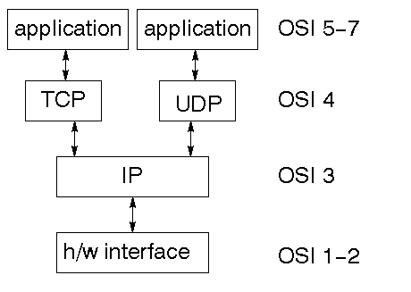

> **tcp/ip 协议栈是OSI模型的一部分**



### IP

> IP 层提供了无连接的不可靠的传输系统，任何数据包之间的关联必须依赖更高的层来提供
>
> IP 层包头支持数据校验，在包头包含源地址和目的地址
>
> IP 层通过路由连接到因特网，还负责将大数据包分解位更小的包，并传输到另一端后进行重组

### UDP

> UDP 是无连接的、不可靠的。
>
> 它包括IP数据报的内容和端口号的校验

### TCP

> TCP构建与IP之上的面向链接的协议
>
> 它提供了一个虚电路使得两个应用进程可以通过它来通信。
>
> 通过端口号来识别主机上的服务

## Go net 包

解析ip地址

```go
addr := net.ParseIP(name)
```

IP 掩码

```go
addr := net.ParseIP(name)
mask := net.DefaultMask()
network := addr.Mask(mask)
ones,bits := mask.Size()
```

主机查询

```go
addrs,err := net.LookupHost(name)
```

获取服务端口

在 unix 系统中，/etc/service 文件列出了常用的端口

```go
port,err := net.LookupPort("tcp","telnet") // telnet 23 端口
```

## 序列化

XDR (外部资料表示法) RFC 1832 ，该表示由 sun 公司发明。但该序列化不包含类型信息，XDR 是天生不安全的

ASN.1 当初是一个为电信行业设计的复杂标准。当前主要用于对认证系统中普遍使用的 x.509 证书的编码。Go 对 ASN.1 支持主要是 x.509 证书的读写。

> asn1 允许任意大小的整数。在go中是区分无符号和有符号的整数，因此一个超出了int64最大值的uint64，可能会失败。

JSON

gob：go 特有的序列化。只能编码go的数据类型。支持除了 interface、function、channel 之外的所有数据类型。gob 编解码对结构体是否导出没有影响

```go
type Person struct {
   	Name string
}

type Person2 struct {
    name string
}

p := Persion{
    Name:"fafa"
}
encoder := gob.NewEncoder(os.Stdout)
encoder.Encode(&p)

var p2 Person2
de := gob.NewDecoder(os.Stdout)
de.Decode(&p2)

```

## 字符编码

#### utf16 

utf16 编码可以用16位字节无符号整形数组处理。

将一个Go的utf-8正常编码的字符串转换 utf-16 编码，应先将字符串转成 []rune 数组，

#### 小端序和大端序


## 安全

