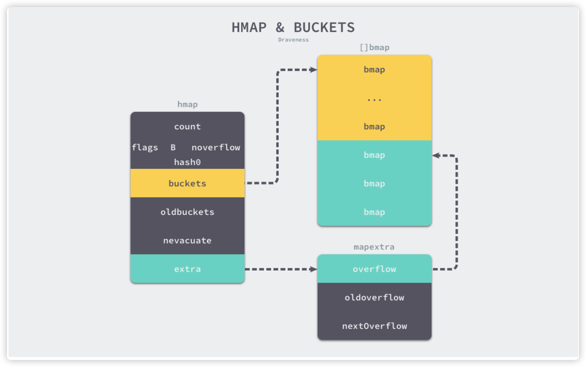
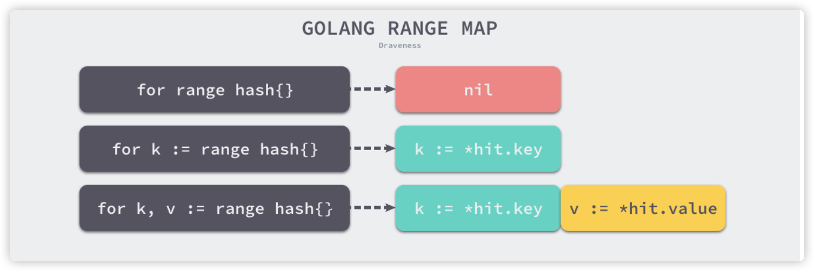

# 哈希表

哈希表的关键点在于：哈希函数和冲突解决方法

### 哈希函数

哈希函数的选择在很大程度上能够决定哈希表的读写性能，在理想情况下，哈希函数应该能够将不同的键映射到不同的索引上，这要求 **哈希函数输出范围大于输入范围**，由于键的数量远远大于映射范围，所以实际使用时，理想结果不可能实现。

**不均匀哈希函数**：较均匀的哈希函数中，哈希增删改查都是 O(1) 的时间复杂度，不均匀的哈希函数会导致所有的操作都会占用最差 O(n) 的复杂度。

### 冲突解决

#### 开放寻址法：

> 核心思想是对数组中的元素依次探测和比较以判断目标键值对是否存在于哈希表中。

**开放法发写入数**：

当一个 key1 的位置已经被 key2 占用时，会在 key2 的后面寻找空闲的位置放置 key1，在进行读取 key1 的值时，会先取模比较 key1 和 key2 的值是否相同，不同则继续往后查找。

**开发法读取数据：**

当需要查找某个键对应的值时，就会从索引的位置开始对数组进行线性探测，找到目标键值对或者空内存就意味着这一次查询操作结束。

开放寻址法中性能影响最大的就是装载因子，它是数组中元素的数量与数组大小的比值，随着装载因子的增加，线性探测的平均用时就会逐渐增加，这同时会影响哈希表的读写性能，当装载率超过 70%之后，哈希表的性能就会急剧下降，而一旦装载率达到 100%，整个哈希表就会完全失效，这是查找任意元素都需要遍历数组中全部的元素，所以在实现哈希表时一定要时刻关注装载因子的变化。

#### 拉链法：

绝大部分的编程语言都采用拉链发实现哈希表，实现比开放寻址复杂，但是平均查找的长度比较短，存储的节点的内存是动态申请的。

拉链法一般会使用数组加上链表，有些的语言会采用红黑树进行优化，拉链法会使用链表数组作为哈希底层的数据结构，可以将它看做一个扩展的二维数组。

**拉链法写入数据：**

将一个键值对写入哈希表时，先对键求出哈希值，根据哈希取模选择一个桶，找到桶之后就可以遍历当前桶中的链表，两种情况如下：

1. 找到键相同的键值对--更新键对应的值
2. 没有找到键相同的键值对 ---- 在链表末尾追加新键值对

一个性能比较好的哈希表中，每一个桶中都应该有 0~3 个元素，计算哈希、定位桶和遍历链表三个过程都是哈希读写操作的主要开销，拉链法的装载因子：`装载因子 = 元素数量 / 桶数量`，一般情况下，拉链法的哈希表装载因子都不会超过 1。

## go map 实现

go 使用 `hmap` 结构体来表示哈希

```go
type hmap struct {
  count int
  flags uint8 
  B uint8
  noverflow uint16
  hash0 uint32
  
  buckets unsafe.Pointer
  oldbuckets unsafe.Pointer
  nevauate uintptr

  extra *mapextra
}
```

> count：表示当前哈希表中的元素数量
>
> B：表示当前哈希表持有的 buckets 数量，因为哈希表中桶的数量是 2 的倍数，所以该字段会存储对数，len(buckets) == 2^B
>
> hash0：表示哈希种子，为哈希函数的结果引入随机性，这个值在创建哈希表时确定，并在调用哈希函数时作为参数传入。
>
> oldbucktes：表示哈希在扩容时用于保存之前 buckets 的字段，大小是当前 buckets 的一半



哈希表 hmap 的桶就是 bmap ，每一个 bmap 都能存储 8 个键值对，当哈希表中存储的数据过多，单个桶无法装满时就会使用 `extra.overflow` 中桶存储溢出的数据。

bmap 存储了键的哈希高 8 位，通过比较不同键哈希的高 8 位可以减少访问键值对次数以提高性能

```go
type bmap struct {
  tophash [bucketCnt]uint8
}
```

由于哈希表中可能存储不同类型的键值对并且 Go 语言也不支持泛型，所以键值对占据的内存空间大小只能在编译时进行推导，这些字段在运行时也是通过内存地址的方式直接访问的，所以定义中就没有包含这些字段，但是能根据编译期间的 `cmd/compile/internal/gc.bmap` 函数对它的结构重建：

```go
type bmap struct {
  topbits [8]uint8
  keys [8]keytype
  values [8]valuetype
  pad uintptr
  overflow uintptr
}
```

哈希表存储的数据逐渐增多，会对哈希表进行扩容或者使用额外的桶存储溢出的数据，不会让单个桶中的数据超过 8 个，创建过多的溢出桶最终也会导致哈希的扩容。

> Go 使用拉链法解决哈希碰撞的问题，它的访问、写入和删除等操作都在编译期间转换成了运行时的函数或者方法。
>
> 哈希在每一个桶中存储键对应哈希的前 8 位，当对哈希进行操作时，tophash 就成为了一级缓存帮助哈希快速遍历桶中元素，每一个桶都只能存储 8 个键值对，一旦当前哈希的某个桶超出 8 个，新的键值对就会被存储到哈希的溢出桶中。
>
> 随着键值对数量的增加，溢出桶的数量和哈希的装载因子也会逐渐升高，超过一定范围就会触发扩容，扩容会将桶的数量翻倍，元素在分配的过程也是在调用写操作时增量进行的，不会造成性能的瞬时巨大抖动。

## 遍历 map 的实现

在遍历哈希表时，编译器会使用 `runtime.mapiterinit` 和 `runtime.mapiternext` 两个运行时函数重写原始的 for/range 循环：

```go
ha := a
hit := hiter(n.Type)
th := hit.Type
mapiterinit(typename(t),ha,&hit)
for ;hit.key != nil;mapiternext(&hit) {
  key := *hit.key
  val := *hit.val
}
```



不同的方式遍历哈希插入的语句，上面三种不同的情况会分别向循环体插入不同的赋值语句，遍历哈希表时会使用 `runtime.mapiterinit` 函数初始化遍历开始的元素：

```go
// 该函数初始化 hiter 结构体中的字段，并使用 runtime.fastrand 生成一个随机数帮助我们随机选择一个桶开始遍历，Go 在设计哈希表遍历时就是不想让使用者依赖固定的遍历顺序，所以引入了随机数保证遍历的随机性
func mapiterinit(t *maptype,h *hmap,it *hiter) {
  it.t = t
  it.h = h
  it.B = h.B
  it.buckets = h.buckets
  
  r := uintptr(fastrand())
  it.startBucket = r & bucketMask(h.B) // 取模选择一个桶
  it.offset = uint8(r >> h.B & (bucketCnt - 1))
  it.bucket = it.startBucket
  mapiternext(it)
}
```

哈希表的遍历过程：首先选出一个绿色的正常桶开始遍历，随后遍历对应的所有黄色溢出桶，最后一次按照索引顺序遍历哈希表中其它的桶，直到所有的桶都被遍历完成。