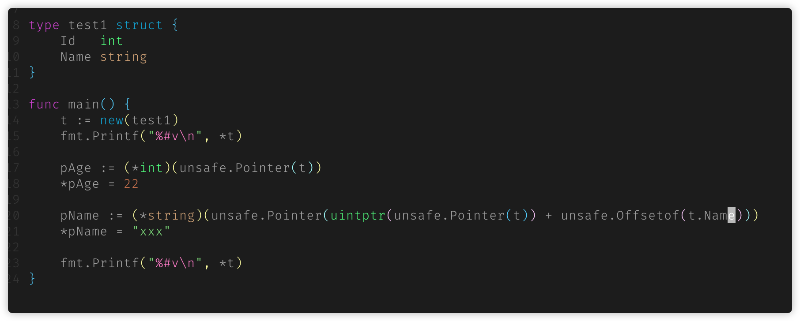

Go 中不同指针指针类型的转换，需要使用 `unsafe.Pointer` ，具体的转换规则：

1. 任何指针都可以转换为 `unsafe.Pointer`
2. `unsafe.Pointer` 可以转换为任何指针
3. `uintptr` 可以转换为 `unsafe.Pointer`
4. `unsafe.Pointer` 可以转换为 `uintptr`

**uintptr 可以进行偏移计算，这样就可以访问特定的内存，对内存进行读写**

