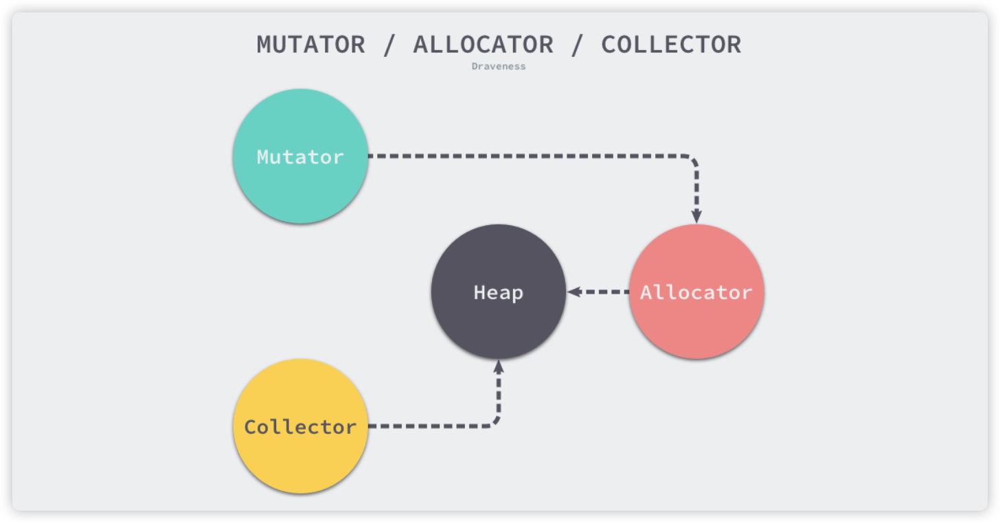
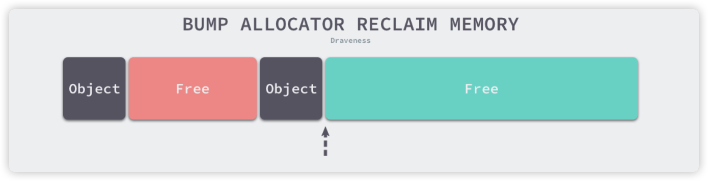
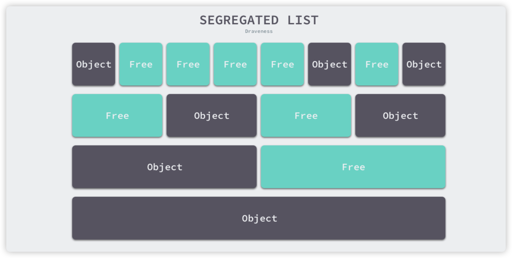
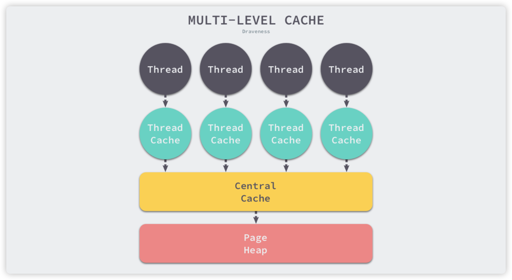
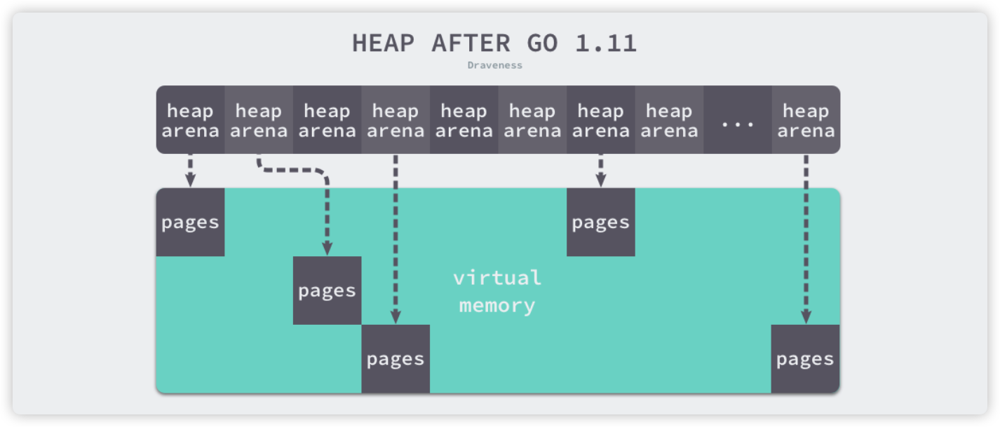
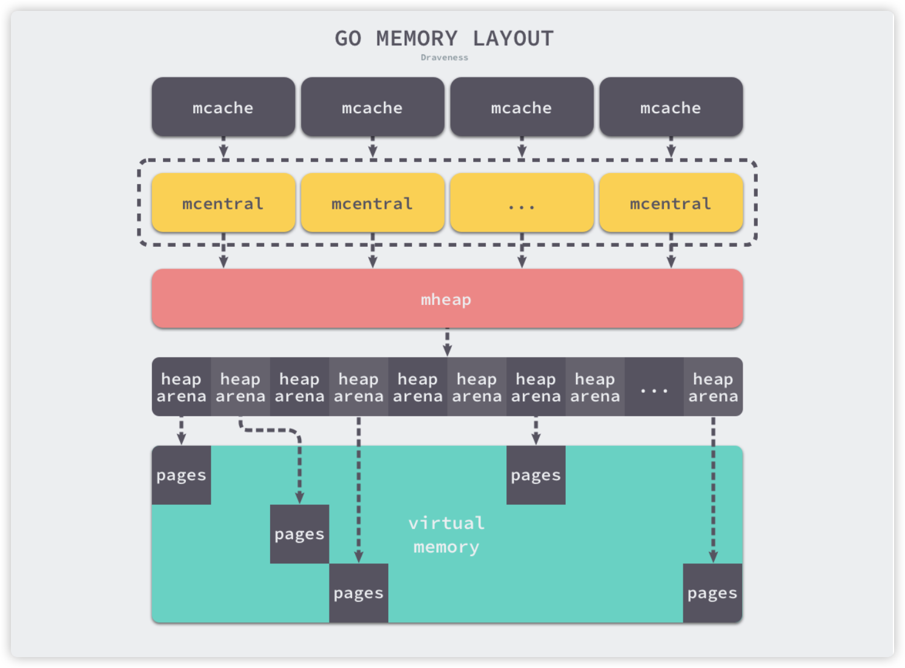
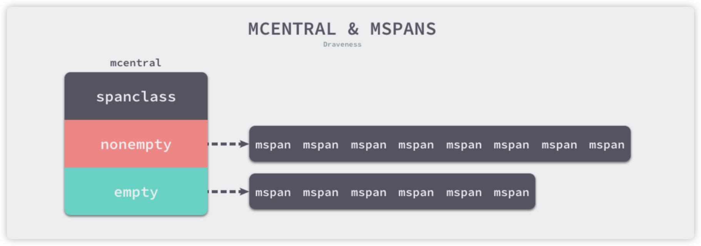

## 内存分配器

程序中的数据和变量都会被分配到程序所在的虚拟内存中，内存空间包含两个重要区域 - 栈区（Stack）和堆区（Heap）。函数调用的参数、返回值以及局部变量大都会被分配到栈上，这部分内存会由编译器或者开发者进行管理。堆中的对象由内存分配器并由垃圾收集器回收。

### 设计原理

内存管理一般包含三个不同的组件：用户程序（Mutator）、分配器（Allocator）和收集器（Collector）。当用户程序申请内存时，会通过内存分配器申请新的内存，而分配器会负责从堆中初始化相应的内存区域。



#### 分配方法

内存分配器一般包含两种分配方法：线性分配器（Sequential Allocator），空闲链表分配器（Free-List Allocator）。

#### 线性分配器

使用线性分配器，只需要在内存中维护一个指向内存特定位置的指针，当用户程序申请内存时，分配器只需要检查剩余的空闲内存，返回分配的内存区域并修改指针在内存中的位置。



优点是：有较快的执行速度，实现复杂度较低。

缺点是：如果已经分配的内存被回收，线性分配器是无法重新利用的。

由于线性分配器的这种特性，所以需要合适的垃圾回收算法配合使用，标记压缩（Mark Compact）、复制回收（Copying GC）和分代回收（Generational GC）等算法可以通过拷贝的方式整理存活对象的碎片，将空闲内存定期合并，这样就能利用线性分配器的效率提升内存分配器的性能。

#### 空闲链表分配器

空闲链表分配器，可以重用已经被释放的内存，它在内部会维护一个类似链表的数据结构。当程序申请内存时，空闲链表分配器会依次遍历空闲的内存块，找到足够大的内存，然后申请新的资源并修改链表。

因为不同的内存块以链表的方式连接，所以使用这种方式分配内存可以重新利用回收的资源，但是因为分配内存时需要遍历链表，所以时间复杂度是 O(n) ，空闲链表分配器可以选择不同的策略在链表中的内存块进行选择，最常见的是以下四种方式：

- 首次适应（First-Fit）：从链表头开始遍历，选择第一个大小大于申请内存的内存块
- 循环首次适应（Next-Fit）：从上次遍历的结束位置开始遍历，选择第一个大小大于申请内存的内存块
- 最优适应（Best-Fit）：从链表头遍历整个链表，选择最合适的内存块
- 隔离适应（Segregated-Fit）：将内存分割成多个链表，每个链表中的内存大小相同，申请内存时先找到满足条件的链表，再从链表中选择合适的内存块。



**隔离适应策略**

该策略会将内存分割成由 4、8、16、32 字节的内存块组成的链表，当向内存分配器申请 8 字节的内存时，会在第二个链表找到空闲的内存块并返回，隔离适应策略减少了需要遍历的内存块数量，提高了内存分配效率。

#### 分级分配

线程缓存分配（Thread-Caching Malloc，TCMalloc）用于分配内存的机制。它的核心理念是使用多级缓存根据对象大小分类，并按照类别实施不同的分配策略。

**对象大小**

Go 语言的内存分配器会根据申请分配的内存大小选择不同的处理逻辑，运行时根据对象的大小将对象分叉微对象、小对象和大对象三种：

|  类别  |    大小     |
| :----: | :---------: |
| 微对象 | （0，16B）  |
| 小对象 | [16B，32KB] |
| 大对象 | (32KB，+∞)  |

**多级缓存**

内存分配器不仅会区别对待大小不同的对象，还会将内存分成不同的级别管理，TCMalloc 和 Go 运行时分配器都会引入线程缓存（Thread Cache）、中心缓存（Central Cache）和页堆（Page Heap）三个组件分级管理内存：



**多级缓存内存分配**

线程缓存属于每一个独立的线程，它能够满足线程上绝大多数的内存分配需求，因为不涉及多线程，所以不需要互斥锁来保护内存，这能够减少锁竞争带来的性能损耗。当线程缓存不能满足需求时，就会使用中心缓存来作为补充解决小对象的内存分配问题。在遇到 32KB 以上的对象时，内存分配器就会选择页堆直接分配大量的内存。

#### 虚拟内存布局

1.10 以前，堆区的内存空间都是连续的，在 1.11 以后使用了稀疏的堆内存空间替代了连续的内存，解决了连续内存带来的限制以及在特殊场景下可能出现的问题。

**线性内存**

1.10 以前会初始化整片虚拟内存区域，spans、bitmap、arena 分别预留 512MB、16GB 以及 512GB 的内存空间，这些都是虚拟内存不是真正的物理内存。


- spans 区域存储了指向内存管理单元 runtime.mspan 指针，每个内存单元会管理几页的内存空间，每页大小为 8KB
- bitmap 用于标识 arena 区域中的哪些地址保存了对象，位图中的每个字节都会表示堆区中的 32 字节是否包含空闲
- arena 区域是真正的堆区，运行时会将 8KB 看做一页，这些内存页中存储了所有堆上初始化的对象

Go 语言在垃圾回收时会根据指针的地址判断对象是否在堆中，并根据 `arena` 的基地址计算该地址所在的页数并通过 `spans` 数组获得管理该片内存的管理单元 runtime.mspan（`spans` 数组中多个连续的位置可能对应同一个 runtime.mspan），这种方式在 C 和 Go 混合使用时会导致程序崩溃：

1. 分配的内存地址会发生冲突，导致堆的初始化和扩容失败
2. 没有被预留的大块内存可能会被分配给 C ，导致扩容后的对不连续

线性的堆内存需要预留大块的内存空间，但是申请大块的内存空间而不使用是浪费，不预留内存空间则会在特殊场景下造成程序崩溃。

**稀疏内存**



由运行时的 runtime.heapArena 二维数组管理内存，每个单元都会管理 64MB 的内存空间

### 内存管理组件

Go 内存分配器包含内存管理单元、线程缓存、中心缓存和页堆几个重要组件



Go 语言在初始化时，每一个处理器都会被分配一个线程缓存 runtime.mcache 用于处理微对象和小对象的分配，它们会持有内存管理单元 runtime.mspan 。

每个类型的内存管理单元都会管理特定大小的对象，当内存管理单元中不存在空闲对象时，它们会从 `runtime.mheap` 持有的 134 个中心缓存 `runtime.mcentral` 中获取新的内存单元，中心缓存属于全局的堆结构体 `runtime.mheap` ，它会从操作系统中申请内存。

#### 线程缓存

`runtime.mcache` 是 Go 语言中的线程缓存，它会与线程上的处理器一一绑定，主要用来缓存用户程序申请的微小对象。每一个线程缓存都持有 67*2 个 `runtime.mspan`，这些内存管理单元都存储在结构体 `alloc` 字段中。

#### 中心缓存

`runtime.mcentral` 是内存分配器的中心缓存，每一个中心缓存都会管理某个跨度类的内存管理单元，它会同时持有两个 `runtime.mSpanList` ，分别存储包含空闲对象的链表和不包含空闲对象的链表。

```go
type mcentral struct {
  lock mutex
  spanClass spanClass
  nonempty	mSpanList
  empty			mSpanList
  nmalloc	uint64
}
```



`mcentral` 结构体在初始化时，两个链表都不包含任何内存，程序运行时会扩容结构体持有的两个链表，`nmalloc` 字段记录了该结构体中分配的对象个数。

#### 页堆

`runtime.mheap` 是内存分配的核心结构体，Go 程序中只会存在一个全局的结构，而堆上初始化的所有对象都由该结构体统一管理，该结构体 `central` 字段表示全局的中心缓存列表，`arenas` 表示管理堆区内存区域。

页堆中包含一个长度为 `67<<1` 的 mcentral 数组，其中 67 个为跨度类需要的 scan 的中心缓存，另外 67 个是 noscan 的中心缓存。

### 内存分配

#### 微对象

Go 运行时将小于 16 字节的对象划分为微对象，它会使用线程缓存上的微分配提高微对象分配的性能。主要使用它来分配较小的字符串以及逃逸的临时变量，微分配器可以将多个较小的内存分配请求合入同一个内存块中，只有当内存块中的所有对象都需要被回收时，整片内存才可能被回收。

微分配器管理的对象不可以是指针类型，管理多个对象的内存块大小 `maxTinySize` 是可以调整的，在默认情况下，内存块的大小为 16 字节。`maxTinySize` 值越大，组合多个对象的可能性就越高，内存浪费也就越严重；`maxTinySize` 越小，内存浪费就会越少。

#### 小对象

小对象指大小为 16 字节到 32768 字节的对象以及所有小于 16 字节的指针类型的对象，小对象分配可以分为三步：

1. 确定分配对象的大小以及跨度类 `runtime.spanClass`
2. 从线程缓存、中心缓存或者堆中获取内存管理单元并从内存管理单元找到空闲的内存空间
3. 调用 `runtime.memclrNoHeapPointers` 清空空闲内存中的所有数据

#### 大对象

运行时对于大于 32KB 的大对象会单独处理，不会从线程缓存或者中心缓存中获取内存管理单元，而是直接在系统的栈中调用 `runtime.largeAlloc` 函数分配大片内存。


## 垃圾收集器

### 设计原理

#### 标记清除（Mark-Sweep）

标记清除收集器是跟踪式垃圾收集器，其执行过程可以分成标记（Mark）和清除（Sweep）两个阶段：

1. 标记阶段：从根对象出发查找并标记堆中所有存活的对象
2. 清除阶段：遍历堆中的全部对象，回收未被标记的垃圾对象并将回收的内存加入空闲链表

标记清除的整个过程中，用户程序不能执行，需要使用更复杂的机制来解决 STW (Stop the World) 问题。

#### 三色抽象

三色抽象为了解决原始标记清除算法带来的长时间 STW。三色标记算法将程序中的对象分成白色、黑色和灰色三类：

- 白色对象：潜在的垃圾，其内存可能会被垃圾收集器回收
- 黑色对象：活跃的对象，包括不存在任何引用外部指针的对象以及从根对象可达的对象
- 灰色对象：活跃的对象，因为存在指向白色对象的外部指针，垃圾收集器会扫描这些对象的子对象

