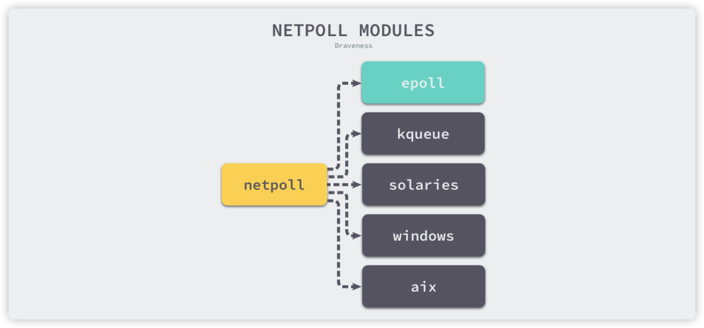

## 并发编程的几个难点

- 数据竞争（race conditions）

- 原子性（Atomicity)

- 内存同步访问（Memory  Access Synchronization）

- 死锁、活锁、饥饿（Deadlocks、Livelocks and Starvation）

  > 科夫曼条件，确保至少有一个条件不成立，就可以防止死锁：
  >
  > - 互斥条件（Mutual Exclusion）
  > - 等待条件（Wait For Condition）
  > - 不抢占（No Preemption）
  > - 循环等待（Circular Wait）
  >
  > 活锁的定义：正在主动执行并发操作的程序，但这些操作无法向前移动程序的状态。

- 并发安全性

  ```go
// CalculatePi 在begin 和 end 之间计算 Pi 的数字
  // 在内部，CalculatePi 会创建 FLOOR((end-begin)/2) 递归调用
  // CalculatePi 并发写入 Pi 将由 Pi 结构内的同步锁处理
  func CalculatePi(begin,end int64,pi *Pi)
  ```
  
  > 当需要暴露涉及并发问题的函数、方法和变量时，请尽量涵盖以下：
  >
  > - 谁对这个并发负责
  > - 问题空间如何映射到并发原语
  > - 谁对这个同步负责
  
## Go 的并发构建模块

#### goroutine

goroutine 的使用是非常廉价的，由 Go 的 runtime 控制存储堆栈的内存大小

```go
	memConsumed := func() uint64 {
		runtime.GC()
		var s runtime.MemStats
		runtime.ReadMemStats(&s)
		return s.Sys
	}

	var c <-chan interface{}

	var wg sync.WaitGroup

	noop := func() {
  		wg.Done()
  		<-c
  	}
  
  	const numGoroutines = 1e4
  
  	wg.Add(numGoroutines)
  
  	before := memConsumed()
  
  	for i := numGoroutines; i > 0; i-- {
  		go noop()
  	}
  
  	wg.Wait()
  
  	after := memConsumed()
  
  	fmt.Printf("%.3fkb", float64(after-before)/numGoroutines/1000)
  
```

  上面代码的内存占用在 go version 1.13.4 时只会有 0.177kb 的大小。

  > 操作系统级别，使用线程代价非常高昂。操作系统线程必须保存寄存器值，查找表和内存映射等内容，才能在操作成功后切换到当前线程，然后它必须为传入线程加载相同的信息。

#### sync 包

sync 包包含对低级别内存访问同步并发原语

> **WaitGroup**：如果不关心并发操作的结果，或者有其他方式收集结果，那么 WaitGroup 等待一组并发操作完成好的方法。否则推荐使用 channel 和 select。
>
> **Cond**：实现了一个条件变量，用于等待或宣布事件发生时 goroutine 的交汇点。事件是指两个或更多的 goroutine 之间的任何信号，仅指事件发生了，不包含其他任何信息。
>
> **Pool**：对象池模式的并发安全实现

#### channels

```go
intStream := make(chan int)
close(intStream)
integer,ok := <-intStream // 0 false
```

> 上面的代码在关闭通道前没有把任何值放入通道，即便如此依然可以执行读取操作，而且尽管通道处在关闭状态，依然可以无限期的在此通道上执行读取操作。这是为了支持单个通道的上游写入器可以被多个下游读取器读取。
>
> 关闭某个通道同样可以被作为向多个 goroutine 同时发送消息的方式之一。如果有多个 goroutine 在单个通道上等待，可以简单的关闭通道，而不是循环解除每个 goroutine 的阻塞。

## 上下文 context

上下文 `context.Context` 是用来设置截止日期、同步信号，传递请求相关值得结构体。

`context.Context` 该接口定义了 4 个需要实现的方法：

1. `Deadline`： 返回 `context.Context` 被取消的时间（完成工作的截止日期）
2. `Done` ：返回一个 `channel` ，这个 `channel` 会在当前工作完成或者上下文被取消之后关闭，多次调用 `Done` 方法会返回同一个 `channel` 
3. `Err` ：返回 `context.Context` 结束的原因，它只会在 `Done` 返回的 channel 被关闭才会返回非空的值
4. `Value` ：从 `context.Context` 中获取键对应的值，对于同一个上下文来说，多次调用 `Value` 并传入相同的 `Key` 会返回相同的结果

## 调度器

Go 语言的调度器通过使用与 CPU 数量相等的线程减少线程频繁切换的内存开销，同时在每一个线程上执行额外开销更低的 Goroutine 来降低操作系统和硬件的负载。

Go 目前的调度模式：

- 抢占式调度器：

  - 基于协作的抢占式调度器：1.2 ~ 1.13

  > 通过编译器在函数调用时插入抢占检查指令，在函数调用时检查当前 Goroutine 是否发起了抢占请求，实现基于协作的抢占式调度。
  >
  > Goroutine 可能会因为垃圾回收和循环长时间占用资源导致程序暂停。

  - 基于信号的抢占式调度器：1.14 ~ 

  > 实现基于信号的真抢占式调度
  >
  > 垃圾回收在扫描栈时会触发抢占调度
  >
  > 抢占的时间点不够多，还不能覆盖全部的边缘情况

**GMP 模型**：

**G**

Goroutine 是 Go 语言调度器中待执行的任务，它在运行时调度器中的地位与线程在操作系统中差不多，但是它占用更小的内存空间，也降低了上下文切换的开销。它是 Go 语言在用户态提供的线程，作为一种粒度更细的资源调度单元。

**M**

M 是操作系统线程，调度器最多可以创建 10000 个线程，其中大多数的线程都不会执行用户代码（可能陷入系统调用），默认最多只会有 GOMAXPROCS 个活跃线程能够正常运行（可以修改环境变量或者 runtime 时修改）

**P**

P 是线程和 Goroutine 的中间层，它能提供线程需要的上下文环境，也会负责调度线程上的等待队列，通过处理器 P 的调度，每个内核线程都能够执行多个 Goroutine，它能在 Goroutine 进行一些 I/O 操作及时切换，提高线程的利用率。


## 网络轮询器

网络轮询器不仅用于监控网络 I/O ，还能用于监控文件的 I/O ，它利用操作系统提供的 I/O 多路复用模型来提升 I/O 设备的利用率以及程序性能。

I/O 模型：

- 阻塞 I/O：对文件和网络的读写操作在默认情况下都是阻塞的，当通过 read 或者 write 对系统文件进行读写时，应用程序就会被阻塞。

  如当执行 read 系统调用时，应用会从用户态陷入内核态，内核会检查文件描述符是否可读，当文件描述符中存在数据时，操作系统内核会将准备好的数据拷贝给应用并将控制权交回。


- 非阻塞 I/O：当一个进程把一个文件描述符设置成非阻塞时，执行 read 和 write 等 I/O 操作就会立即返回。

  如第一次从文件描述符中读取数据会触发系统调用并返回 EAGAIN 错误，EAGAIN 意味着该文件描述符还在等待缓冲区中的数据，随后应用会不断轮询调用 read 知道它的返回值大于 0，这是应用程序就可以对读取操作系统缓冲区的数据并进行操作。进程使用非阻塞 I/O 操作可以在等待过程中执行其他的任务，增加 CPU 资源的利用率。

  

- I/O 多路复用：被用来处理同一个事件循环中的多个 I/O 事件。I/O 多路复用需要使用特定的系统调用，常见的如：`select` ，该函数可同时监听 1024 个文件描述符的可读或者可写状态.

  多路复用函数会阻塞监听一组文件描述符，当文件描述符的状态转变为可读或者可写时，`select` 会返回可读或者可写事件的个数，应用就可以在输入的文件描述符中查找哪些可读或者可写，然后执行相应的操作。

Go 语言为了提高在不同操作系统上的 I/O 操作性能，使用平台特定的函数实现了多个版本的网络轮询模块，位于 `runtime/netpoll_*.go` 这些模块在不同平台上实现了相同的功能，构成了一个常见的树形结构。



### 多路复用

