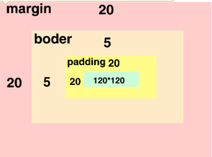

### 标准盒子模型



元素框的最内部分是实际内容（content）

包围内容的是内边距（padding），内边距呈现了元素的背景

内边距的边缘是边框（border）

边框以外是外边距（margin），外边距默认是透明的，因此不会遮挡其后的任何元素

```css
div {
    width:100px;
    height:150px;
    padding:10px;
    border:1px solid red;
    margin:20px;
    background-color:pink;
}
```

盒模型计算方式：

盒子所占宽度：内容的宽度 + 内边距（左、右） + 边框（左、右）+ 外边距（左、右）

盒子所占高度：内容高度 + 内边距（上、下）+ 边框（上、下）+ 外边距（上、下）

计算上面 div 盒子占用（w3c 盒子模型）：

宽度：100 + 20 * 2 + 10 * 2 + 1 * 2 = 162px

高度：150 + 20 * 2 + 10 * 2 + 1 * 2 = 212px

可视化宽度：border + padding + div.width

可视化高度：border + padding + div.height


### 块级元素和行内元素区别

块级元素特点：

1. 总是从新行开始
2. 高度、行高、外边距以及内边距都可以控制
3. 宽度默认是容器的 100%
4. 可以容纳内联元素和其他块元素

行内元素的特点：

1. 和相邻行内元素在一行上
2. 高、宽无效，但水平方向的 padding 和 margin 可以设置
3. 默认高度就是它本身内容的高度
4. 行内元素只能容纳文本或者其他行内元素


行高等于 height 高度，文字会垂直居中


