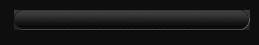
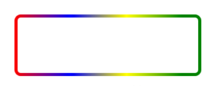
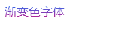
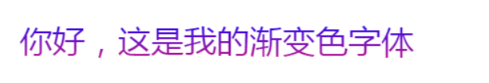
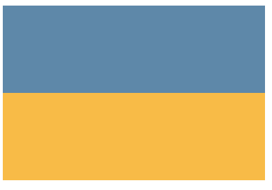
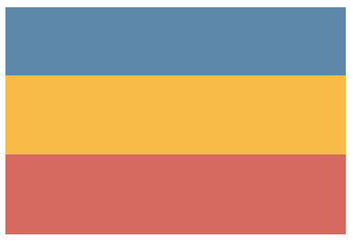
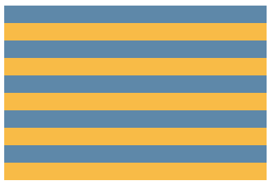
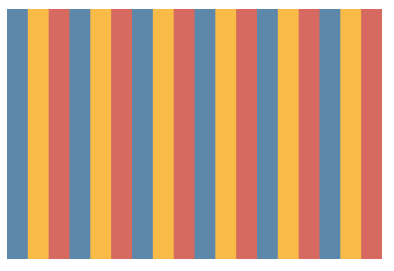
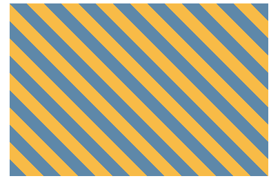
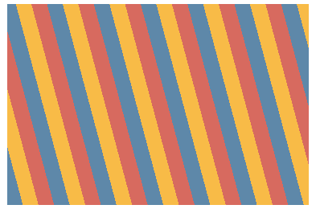

### CSS 三大特性

层叠性，继承性，优先级，特殊性

### css 一些技巧

行高可以使文字垂直居中

对于 div 内的 img 推荐使用 background 样式移动 img

盒子居中对齐 margin : 0 auto

**嵌套块元素垂直外边距的合并**

解决方案：

1. 在父元素用 border : 1px ;
2. 在父元素用 padding : 1px
3. 父元素 overflow : hidden

float 默认让元素转化为行内块


### 清除浮动

清除浮动主要为了解决父级元素因为子级浮动引起内部高度为 0 的问题

给父级元素添加 `overflow : hidden`

`:after ` 伪元素清除浮动

```html
.clearfix::before,.clearfix::after {
	content:'';
	display:table;
}
.clearfix::after {
	clear:both;
}
.clearfix {
	*zoom: 1;
}
```

针对 IE6 IE7 使用 `.clearfix { *zoom:1;}`


### 定位position

静态定位（static）：作用取消定位 `position：static`

相对定位（relative）：

1. 每次移动位置，以自己的左上角为基点
2. 相对定位，通过偏移移动位置，但是原来的所占位置，继续占有

绝对定位（absolute）：

1. 没有父级元素或父级元素未定位，以浏览器屏幕为基点定位
2. 父级元素有定位，则是将元素依据最近的已经定位（绝对、固定或相对定位）的父元素（祖先）进行定位
3. 不会占据原来的位置

一般定位使用 **子绝父相**

使用 position 将盒子模型居中：

```css
.ceshi {
	height: 100px;
    weight:200px;
	position: absolute;	// relative 不行
	left: 50%;			// 水平居中
    margin-left: -100px;	// 水平居中  width 的一半
    top: 50%;			// 垂直居中
    margin-top: -50px;	// 垂直居中 height 的一半
}
```

fix 固定定位：和父元素没有关系，只以浏览器为基点


### 叠放次序 （z-index）


当 div border 重叠时，可以使用 `margin-left : -1` 


`vertical-align` 通常用来控制图片/表单与文字的对齐，不能控制文字居中，不影响块级元素中的内容对齐，只针对行内元素或者行内块元素，特别是行内块元素


### css 精灵技术

**css 精灵是一种处理网页背景图像的方式**，它将一个页面涉及到的所有零星背景图像都集中到一张大图中去，然后将大图应用于网页。这样当用户访问该页面时，**只需向服务发送一次请求**，网页中的背景图像即可全部展示出来，通常情况下，这个由很多小的背景图像合成的大图被称为精灵图，主要使用 `background-position`

当背景图片很少的时候没有必要使用精灵图


### 滑动门原理



类似 [微信首页](weixin.qq.com)

获取上图的左右两边的圆角

```html
<style>
    a {
        display: inline-block;
        background: url() no-repeat;	/* 此处默认是 left */
        color: #fff;
        text-decoration: none;
        height: 33px;
        margin: 100px;
        line-height: 33px;
        padding-left: 15px;
    }
    
    span {
        display: inline-block;
        height: 33px;
        background: url() no-repeat right;
        padding-right: 15px;
    }
</style>

<a href="#">
    <span>首页</span>
</a>
```


### 使用字体图标

```html
<style>
    @font-face {
        font-family: 'icommon';	 /* 这个名字可以随意改 */
        src:	url('fonts/icomoon.eot?7kkyc2');	/* 问号后的是为了兼容IE */
        src:	url('fonts/icomoon.eot?7kkyc2#iefix') format('embedded-opentype'),
            url('fonts/icomoon.ttf?7kkyc2') format('truetype'),
            url('font/icomoon.woff?7kkyc2') format('woff'),
            url('font/icomoon.svg?7kkyc2#icomoon') format('svg');
        font-style: normal;	/* 对字体图标一般使用 i em 所以使用这个属性 */
    }
</style>
```


#### 去除图片底侧缝隙，因为图片适合基线对齐

```css
img {
    vertical-align: top; /* 做初始化 css */
}
```


#### 轮播图结构

```html
<div class="lunbotu">
    <div class="arrow">
        <a href="#" class="arr-l"> < </a>
        <a href="#" class="arr-r"> > </a>
    </div>
        
        <ol>
            <li> 此处是轮播图下面的小圆点 </li>
        </ol>
        
        <ul>
            <li><a href="#"></a></li>
        </ul>
</div>
```


#### 图片自适应，等比例缩放

```html
<style>
    div {
        border: 1px solid #000;
        float: left;
        width: 390px;
        height: 130px;
    }
    img {
        width: 100%;	/*设置图片的宽度和父亲一样宽*/
    }
</style>
<div>
    
</div>
```


#### tab 栏切换

```html
<div class="news">
    <div class="tab-hd">
        <a href="javascript:;" class="cuxiao">促销</a>
        <a href="javascript:;">公告</a>
        <a href="#" class="more">更多</a>
        <div class="line"></div>	//这个是下划线，使用position：absoulte定位
    </div>
</div>
```


#### CSS 指定超出几行自动隐藏

```css
-webkit-line-clamp: n;	// 设置行数，n 为行数 （必选）
display: -webkit-box;	// 盒子模型 （必选）
-webkit-box-orient: vertical;	// 元素排列方式 （必选）

// 案例
-webkit-line-clamp: 3;
display:-webkit-box;
-webkit-box-orient:vertical;
overflow:hidden;	// 隐藏溢出的内容
text-overflow:ellipsis;	// 超出的内容显示省略号
```

#### 边框颜色渐变时，border-radius 失效

```html
<style>
    .content {
        width:300px;
        height:100px;
        box-sizing:border-box;
        padding:5px;
        border-radius:5px;
        background-image:-webkit-linear-gradient(left,red 0%,blue 30%,yellow 60%,green 90%);
    }
     .box {
    	width:100%;
         height:100%;
         border-radius:5px;	// 子元素需要和父元素的 border-radius 一样
         background:#fff;
    } 
</style>

<div class="content">
    <div class="box">
        
    </div>
</div>
```

实现效果：



#### 实现文字渐变

1. 

```html
<p class="font1">渐变色字体</p>
<style>
	.font1{
  background-image: -webkit-linear-gradient(bottom, rgb(201, 21, 134), rgb(20, 123, 255));
  -webkit-background-clip: text;
  color: transparent;
}
</style>
```

**效果：**



**原理：**

先设置背景图为渐变色，然后通过 `backgroun-clip` 属性将文字之外的区域都裁剪掉，最后通过 `color:transparent`  将文字设置为透明色，将后面的背景色显示出来

2. 

```html
<p class="font2" text="你好，我是渐变色字体">你好，我是渐变色字体</p>
<style>
.font2 {
  color:#223aee;
  position: relative;
}

.font2:before{
  content: attr(text);
   position: absolute;
   z-index: 10;
  color:#f82a27;
  -webkit-mask:linear-gradient(to left, #67a621, transparent );
}
</style>
```

**效果：**


**原理：**

> 利用 `content:attr(text)` 获取到元素的 text 属性，插入内容到 p 元素中，然后利用遮罩层的原理让元素的某一个部分显示或隐藏，从而实现渐变色字体

3. 
```html
<p class="font1">你好，这是我的渐变色字体</p>
<style>
.font1{
  font-size:22px;
  background-image: -webkit-linear-gradient(bottom, rgb(201, 21, 134), rgb(20, 11, 255));
  -webkit-background-clip: text;
  -webkit-text-fill-color: transparent;
 }
</style>
```

**效果：**



**原理：**

> 先设置背景图为渐变色，然后通过 background-clip 属性将文字之外的区域都裁剪掉，最后通过 `fill-color:transparent` 将文字填充颜色设置为透明色，将后面的背景色显示出来

[文字渐变方法转载博客](https://blog.csdn.net/qq_32682137/article/details/83751886)


### 条纹渐变色

使用 CSS3 的 `linear-gradient(),repeating-linear-gradient(),radial-gradient(),repeating-radial-gradient()` 实现渐变图像

#### 线性渐变 linear-gradient

第一个参数：可不写，默认值为 to bottom(180deg)，为实现渐变，还需要定义两个颜色节点，每个颜色节点可由两个参数组成，[颜色值 位置值，颜色值 位置值，......]，颜色值为必填项，位置值可为长度，也可以是百分比，非必填项。

例：`linear-gradient(red 30%,blue 80%)` 表示容器顶部 30% 区域被填充为红色，容器中间 50% 高度区域被填充为从红色到蓝色的渐变色，容器底部 20% 区域被填充为蓝色

##### 实现条纹效果

> 当相邻两个颜色的位置值相同时，颜色之间会产生无限小的过渡区域。其产生的效果和条纹一样。

图一：



```html
<style>
    .box {
      width: 300px;
      height: 200px;
      background: linear-gradient(#5e88a9 50%, #f8bb47 50%);
    }
  </style>

  <body>
    <div class="box"></div>
  </body>
```

图二：



```html
<style>
    .box {
      width: 300px;
      height: 200px;
      background: linear-gradient(
        #5e88a9 30%, // 表示 0 - 30 之间显示这个颜色
        #f8bb47 30%, // 使用条纹原理，产生一个无限小的过渡区
        #f8bb47 65%, // 30 - 65 之间显示这个颜色
        #d76a60 0 // css 规范：如果某个色标的位置比整个列表中在它之前的色标位置值都要小，则该色标的位置值会被设置为它前面所有色标位置值的最大值，所以此时 0 也可以是 65%，表示的含义就是 65% 以后显示的颜色为该颜色
      );
    }
  </style>

  <body>
    <div class="box"></div>
  </body>
```

##### 实现条纹背景

需要使用 `background-size` 来控制每一块条纹背景的大小，并且 `background-repeat` 设为 `repeat`

图一：



```html
<style>
    .box {
      width: 300px;
      height: 200px;
      background: linear-gradient(
        #5e88a9 50%,
        #f8bb47 0
      );
      background-size: 100% 40px; // 参数一 定义图像宽度，二 定义图像高度
    }
  </style>

  <body>
    <div class="box"></div>
  </body>
```

图二：



```html
<style>
    .box {
      width: 300px;
      height: 200px;
      background: linear-gradient(
        90deg,
        #5e88a9 33%,
        #f8bb47 0,
        #f8bb47 66%,
        #d76a60 0
      );
      background-size: 50px;
    }
  </style>

  <body>
    <div class="box"></div>
  </body>
```

##### 斜条纹



```html
<style>
    .box {
      width: 300px;
      height: 200px;
      margin: 0 auto;
      background: linear-gradient( // 只能实现 45deg  其它的角度则不太理想
        45deg,
        #5e88a9 25%,
        #f8bb47 0,
        #f8bb47 50%,
        #5e88a9 0,
        #5e88a9 75%,
        #f8bb47 0
      );
      background-size: 40px 40px;
    }
  </style>

  <body>
    <div class="box"></div>
  </body>
```

##### 重复线性渐变 repeating-linear-gradient



```html
<style>
    .box {
      width: 300px;
      height: 200px;
      margin: 0 auto;
      background: repeating-linear-gradient(
        75deg,
        #5e88a9,
        #5e88a9 15px,
        #f8bb47 0,
        #f8bb47 30px,
        #d76a5f 0,
        #d76a5f 45px
      );
    }
  </style>

  <body>
    <div class="box"></div>
  </body>
```

