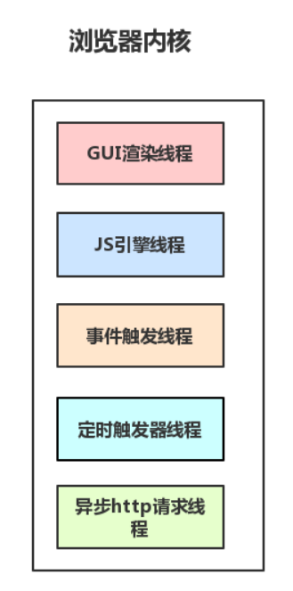
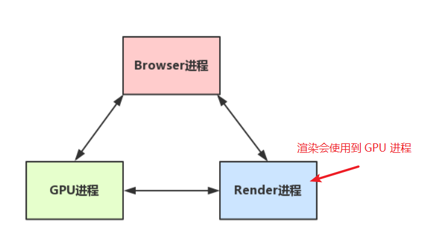
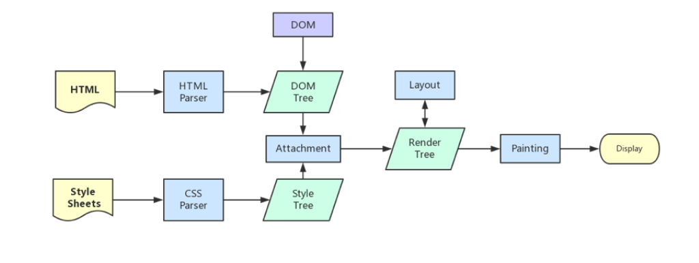
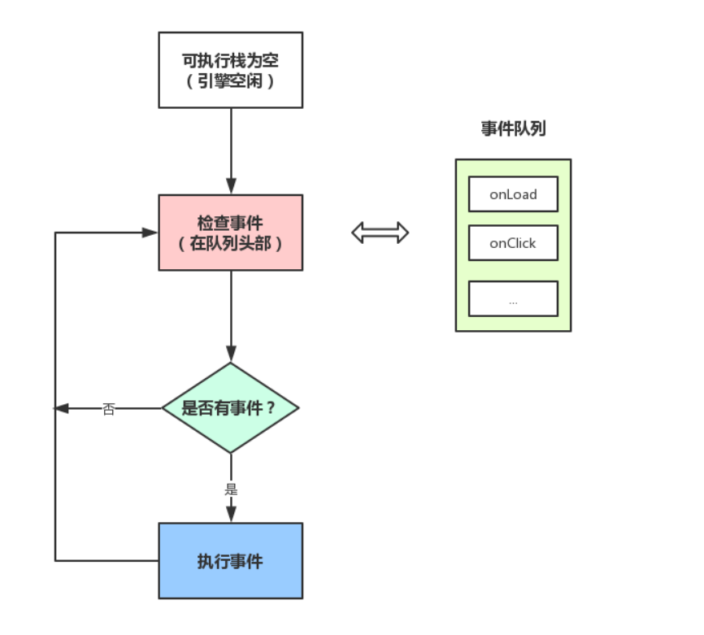

## 浏览器是多进程的

浏览器每个 Tab 页对应一个进程，有时也会将多个进程合并，例如空白标签页。

#### 浏览器包含哪些进程

- Browser 进程：浏览器的主进程（负责协调、主控），只有一个。作用：
  - 负责浏览器界面显示，与用户交互。如前进，后退等。
  - 负责各个页面的管理，创建和销毁其他进程。
  - 将 Renderer 进程得到的内存中的 BitMAP，绘制到用户界面上。
  - 网络资源的管理，下载等。
- 第三方插件进程：每种类型的插件对应一个进程，仅当使用该插件时才创建
- GPU进程：最多一个，用于3D绘制等
- 浏览器渲染进程（浏览器内核）（Renderer 进程，内部是多线程的）：默认每个Tab 页面一个进程，互不影响。主要作用为：
  - 页面渲染，脚本执行，事件处理等。

## 浏览器多进程的优势

- 避免单个page crash 影响整个浏览器
- 避免第三方插件 crash 影响整个浏览器
- 多进程充分利用多核优势
- 方便使用沙盒模型隔离插件等进程，提高浏览器稳定性

**多进程浏览器内存等资源消耗大**

## 浏览器内核（渲染进程）

**页面的渲染，js的执行，事件的循环，都在这个进程内进行，浏览器的渲染进程是多线程的。**

列举一些常驻线程：

- GUI 渲染线程
  - 负责渲染浏览器界面，解析 HTML，CSS，构建 DOM 树和 RenderObject 树，布局和绘制等。
  - 当界面需要重绘（Repaint）或由于某种操作引发回流（reflow)时，该线程就会执行。
  - **GUI 渲染线程与 JS 引擎线程是互斥的，当 JS 引擎执行时 GUI 线程会被挂起（等于被冻结），GUI 更新会被保存在一个队列中等到 JS 引擎空闲时立即被执行**
- JS 引擎线程
  - 也被称为 JS 内核，负责处理 js 脚本程序，如 V8 引擎。
  - JS 引擎线程负责解析 JS 脚本，运行代码。
  - JS 引擎一直等待着任务队列中任务的到来，然后处理，一个 Tab 页（Renderer 进程）中无论什么时候都只有一个 JS 线程在运行 JS 程序。
  - **GUI 线程和 JS 线程互斥，所以如果 JS 执行时间过长，会造成页面渲染不连贯，导致页面渲染加载阻塞。**
- 事件触发线程
  - 归属于浏览器而不是 JS 引擎，用来控制事件循环 （当 JS 引擎繁忙时，需要浏览器另开线程协助）。
  - JS 引擎执行代码块如 setTimeOut 时，也可以来自浏览器内核的其他线程，如鼠标点击，AJAX 异步请求等，会将对应任务添加到事件线程中。
  - 当对应的事件符合触发条件被触发时，该线程会把事件添加到待处理队列的队尾，等待 JS 引擎的处理
  - JS 引擎是单线程，所以这些待处理队列中的事件都得排队等待 JS 引擎处理（当 JS 引擎空闲时才会去执行。
- 定时触发器线程
  - setInterval 和 setTimeout 所在线程
  - 浏览器定时计数器并不是由 JS 引擎计数的，因为 JS 引擎时单线程的，如果处于阻塞状态就会影响计时的准确。
  - 因此通过单独线程来计时并触发定时（计时完毕后，添加到事件队列中，等待 JS 引擎空闲后执行）
- 异步 HTTP 请求线程
  - XMLHttpRequest 在连接后是通过浏览器新开一个线程请求
  - 将检测到状态变更时，如果设置有回调函数，异步线程就会产生状态变更事件，将这个回调再放入事件队列中，再由 JS 引擎执行。

#### 浏览器（Browser）进程和浏览器内核 （Renderer）进程的通信过程

browser 进程如何与内核进程通信：

- Browser 进程收到用户请求，首先需要获取页面内容（如通过网络下载资源），随后将该任务通过 rendererHost 接口传递给 render 进程。
- renderer 进程的 renderer 接口收到消息，简单解释后，交给渲染线程，开始渲染
  - 渲染线程接收请求，加载网页并渲染网页，其中可能需要 browser 进程获取资源和需要 GPU 进程来帮助渲染
  - 可能会有 JS 线程操作 DOM (可能会造成回流并重绘)
  - render 进程将结果传递给 browser 进程
- browser 进程接收到结果并将结果绘制出来

## GUI 渲染线程与 JS 引擎线程互斥原因

由于 js 可以操作 DOM，如果修改这些元素属性时同时渲染界面（JS 线程和 UI 线程同时运行），那么渲染线程前后获得的元素数据就可能不一致。

为了防止渲染出现不可预期的结果，浏览器设置 GUI 渲染线程与 JS 引擎为互斥关系，当 JS 引擎被执行时 GUI 线程会被挂起，GUI 更新则会被保存再一个队列中等到 JS 引擎线程空闲时立即被执行。

## WebWorker 线程

webworker 为 web 内容在后台线程中运行脚本提供了简单的方法，线程可以执行任务而不干扰用户界面，workers 运行在另一个全局上下文中，不同于当前的 window。

- 创建 worker 时， js 引擎像浏览器申请开一个子线程（子线程时浏览器开的，完全受主线程控制，而且不能操作 DOM）
- JS 引擎线程与 worker 线程间通过特定的方式通信（postMessage API，需要通过序列化对象来与线程交互特定的数据）

## WebWorker 与 SharedWorker

- WebWorker 只属于某个页面，不会和其他页面的 render 进程（浏览器内核进程)共享，所以是在 render 进程创建一个新的线程来运行 worker 中的 js 程序。
- SharedWorker 是浏览器所有页面共享的，它不属于某个 render 进程，可以为多个 render 进行共享使用

## 浏览器的渲染流程

浏览器内核拿到内容后，渲染步骤：

- 解析 html 建立 dom 树
- 解析 css 构建 render 树（将 css 代码解析成树形的数据结构，然后结合 dom 合并成 render 树）
- 布局 render 树（layout/reflow），负责各元素尺寸、位置的计算
- 绘制 render 树 （paint），绘制页面像素信息
- 浏览器会将各层的信息发送给 GPU，GPU 会将各层合成，显示在屏幕上
- 渲染完毕后，就是 load 事件，之后就是 js 逻辑处理

### load 事件与 DOMContentLoaded 事件的先后

- 当 DOMContentLoaded 事件触发时，仅当 DOM 加载完成，不包括样式表，图片
- 当 onload 事件触发时，页面上所有 DOM，样式表，脚本，图片都已经加载完成，渲染完毕了

## CSS

**css 是由单独的下载线程异步下载的**

- css 加载不会阻塞 DOM 树解析（异步加载时 DOM 照常构建）
- 会阻塞 render 渲染（渲染时需等待 CSS 加载完毕，因为 render 树需要 css 信息）

## 普通图层和复合图层

浏览器渲染图层一般包含两大类：普通图层以及复合图层

普通文档流可以理解为一个复合图层（也被称为默认复合层，里面不管添加多少元素，其实都是在同一个复合图层中）。

absolute 和 flex 布局，虽然脱离普通文档流，但它任然属于默认复合层。

然后通过硬件加速的方式，声明一个新的复合图层，它会单独分配资源（会脱离普通文档流，这样不管这个复合图层中怎么变化，也不会影响到默认复合层里的回流重绘）。

在 GPU 中，各个复合图层都是单独绘制的，所以互不影响。

#### 如何变成复合图层（硬件加速）

将元素变成一个复合图层，就是硬件加速技术。

- 常用方式：translate3d、translateZ
- opacity 属性，过渡动画（需要动画执行的过程中才会创建合成层，动画没有开始或结束后元素还会回到之前的状态）
- will-chang 属性，一般配合 opacity 与 translate 使用，作用时提前告诉浏览器要变化，这样浏览器会开始做一些优化工作
- video、iframe、canvas、webgl

#### absolute 和硬件加速的区别

absolute 虽然可以脱离普通文档流，但是无法脱离默认复合层，所以，就算 absolute 中信息改变时不会改变普通文档流中 render 树，但是浏览器最终绘制时，是整个复合层绘制的，所以 absolute 中信息的改变，仍然会影响整个复合层的绘制。（如果复合层中内容多，absolute 带来的绘制信息变化过大，资源消耗是非常严重的）。

#### 复合图层的作用

一般一个元素开启硬件加速后会变成复合图层，可以独立于普通文档流，改动后可以避免整个页面重绘，提升性能。

## js 的运行机制

- js 分为同步任务和异步任务
- 同步任务都在主线程上执行，形成一个执行栈
- 主线程之外，**事件触发线程**管理着一个任务队列，只要异步任务有了运行结果，就在任务队列中放置一个事件
- 一旦执行栈中的所有同步任务执行完毕，此时 js 引擎空闲，系统就会读取任务队列，将可运行的异步任务添加到可执行栈中，开始执行

此处可以理解，为什么有时候 setTimeout 的事件不能准确执行，因为在它推入事件列表时，主线程还不空闲，正在执行其它代码，所以自然有误差。

[原文]( http://www.dailichun.com/2018/01/21/js_singlethread_eventloop.html )

