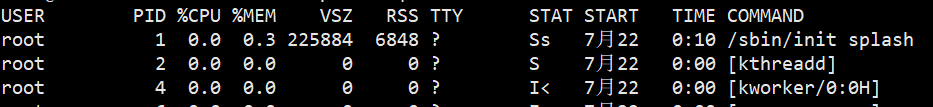
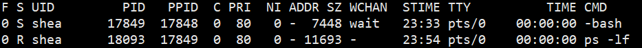
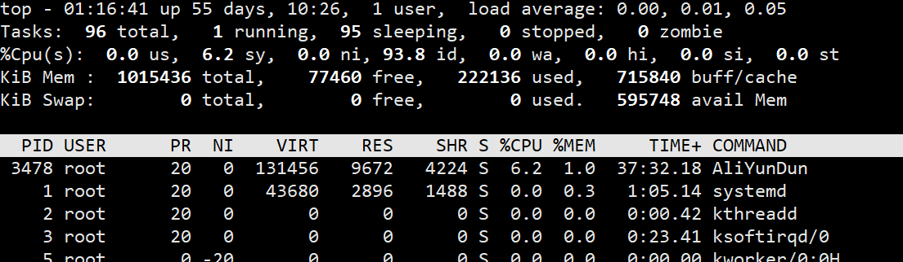
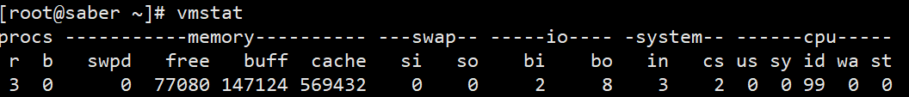

### /proc 的意义及说明

在 Linux 中查看各种状态，其实质是**查看内核中相关进程的数据结构中的项，通过工具将其格式化后输出出来**。因为内核数据是绝对不能随意查看或更改的，所以 Linux 上出现了伪文件系统 /proc ，它是内核中各属性或状态向外提供访问和修改的接口。

数字命名的目录对应的是各进程的 pid 号，其内的文件记录的都是该进程当前的数据信息，且都是只读的。

### 查看进程信息

pstree ：以树的形式显示进程信息

ps ：查看当前这一刻的进程信息（查看的是静态进程信息），要查看实时刷新的动态进程信息使用（top 或 htop），支持 3 种类型的选项：GUN/BSD/UNIX，不同类型的选项其展示的信息格式不一样

`ps aux`

各列的意义：

- %CPU ：表示 CPU 占用百分比（CPU 的衡量方式是占用时间，所以百分比的计算方式是 “进程占用CPU时间/CPU总时间”，而不是 CPU 工作强度的状态）

- %MEM ：表示各进程所占物理内存百分比

- VSZ ：表示各进程占用的虚拟内存，也就是其在线性地址空间中实际占用的内存，单位为 KB

- RSS ：表示各进程占用的实际物理内存，单位 KB

- TTY ：表示属于哪个终端的进程，？ 表示不依赖于终端的进程

- SATA ：进程所处的状态

  - D ：不可中断睡眠
  - R ：运行中或等待队列中的进程
  - S ：可中断睡眠
  - T ：进程处于 stopped 状态
  - Z ：僵尸进程

  对于 BSD 风格的 ps 选项，进程的状态还会显示下面的几个组合信息

  - < ：高优先级进程
  - N ：低优先级进程
  - L ：该进程在内存中有被锁定的页
  - s ：表示该进程是 session leader，即进程组的首进程。例如管道左边的进程，shell 脚本中的 shell 进程
  - l ：表示该进程是一个线程
  - `+` ：表示是前段进程，前段进程一般来说都是依赖于终端

- START ：表示进程是何时被创建的

- TIME ：表示各进程占用的 CPU 时间

- COMMAND ：表示进程的命令行。如果是内核线程，则使用方括号 `[]` 包围

`ps -lf`

各列意义：

- F ：程序的标志位。0 表示该程序只有普通权限，4 表示具有 root 超级管理员权限，1 表示该进程被创建的时候只进行了 fork，没有进行 exec
- S ：进程的状态位，注意 ps 选项加了 `-` 的是非 BSD 风格选项，不会有 `s < N +` 等状态标识位
- C ：CPU 的百分比（衡量方式是时间）
- PRI ：进程的优先级，值越小，优先级越高，越早被调度类选中运行
- NI ：进程的 NICE 值，值为 -20 到 19，影响优先级的方式是 `PRI(new)=PRI(old) + NI` ，所以 NI 为负数的时候，越小将导致进程优先级越高，注意 NICE 值只能影响非实时进程
- ADDR ：进程在物理内存中的哪个地方
- SZ ：进程占用的实际物理内存
- WCHAN ：若进程处于睡眠状态，将显示其对应内核线程的名称，若进程为 R 状态，则显示 `-`

#### ps 后 grep 问题

ps 后加上 grep 筛选目标进程时，grep 自身进程也被显示出来。

通过管道将 ps 结果传递给 grep 时，管道协调了 ps 和 grep 两进程间通信，但管道的本质是进程间数据传递。

**管道左边的输出数据放入内存，由管道右边的进程读取。假如划分的内存不足以完全存放输出数据，则管道左边的进程将一直等待，直到管道右边取出内存中一部分的数据以让管道左边的进程继续输出，而管道右边的进程在管道左边的进程启动后也立刻启动了**，但是它一直处于等待状态，等待接受管道传递来的数据，也就是说，管道左右两端的进程是同时被创建的（不考虑父进程创建进程消耗的微小时间），但数据传输是有先后顺序的，左传，右收，所以可能会造成交叉的情况，左边还没执行完，就捕获到了右边的进程信息。在此处体现在 ps 还没有统计完进程信息是，grep 进程就已经被 ps 抓到了。

将 grep 自身进程排除在结果之外的，方法

1. `ps aux | grep "crond" | grep -v "grep" ` 使用 -v 将 grep 筛选掉
2. `ps aux | grep "cron[d]"` 因为 grep 进程被 ps 捕获时的结果是 “grep cron[d]” ，而使用 cron[d] 匹配时，它将只能匹配 crond ，所以 grep cron[d] 被筛选掉了

uptime ：显示当前时间，已开机运行多少时间，当前有多少用户已登录系统，以及 3 个平均负载值

负载率（load），即特定时间长度内，CPU 运行队列中的平均进程数（包括线程），一般平均每分钟每核的进程数小于 3 都认为正常，大于 5 时负载已经非常高

top ：查看动态进程状态，默认每 5 秒刷新一次

- 第一行 ： 和 w 命令的第一行一样，也和 uptime 命令的结果一样，分别表示：当前时间，已开机时长，当前在线用户，前 1、5、15 分钟平均负载率
- 第二行 ：分别表示：总进程数、running 状态的进程数、睡眠状态的进程数、停止状态进程数、僵尸进程数
- 第三行 ：CPU 的状况
  - us = user mode
  - sy = system mode
  - ni = low priority user mode (nice)(用户空间中低优先级进程的 CPU 占用百分比)
  - id = idle task
  - wa = I/O waiting
  - hi = servicing IRQs(不可中断睡眠，hard interruptible)
  - si = servicing soft IRQs(可中断睡眠，soft interruptible)
  - st = steal (time given to other DomU instances)（被偷走的 CPU 时间，一般被虚拟化软件偷走）
- 第4-5行 ：按字面意思理解
- VIRT ： 虚拟内存总量
- RES ： 实际内存总量
- SHR ：共享内存量
- TIME ：进程占用的 CPU 时间（若开启了时间累积模式，则此处显示的是累积时间）

htop ：可以代替 top 。默认没有安装，`yum -y install htop`

iftop ：动态显示网络接口的数据流量

vmstat ：第一次统计自开机起的平均值信息，第二次开始的统计才是指定刷新时间间隔内的资源利用信息，若不指定刷新时间间隔，则默认只显示一次统计信息。

各列意义：

Procs

- r ： 等待队列的进程数
- b ： 不可中断睡眠的进程数

Memory

- swpd ： 虚拟内存使用总量
- free ：空闲内存量
- buff ：buffer 占用的内存量（buffer 用于缓冲写）
- cache ：cache 占用的内存量（cache 用于缓存读）

Swap

- si ：从磁盘加载到 swap 分区的数据流量，单位 kb/s
- so ：从 swap 分区写到磁盘的数据流量，单位 kb/s

IO

- bi ：从块设备接受到数据的速率，单位 blocks/s
- bo ：发送数据到块设备的速率，单位 blocks/s

System

- in ：每秒中断数，包括时钟中断数量
- cs ： 每秒上下文切换次数

CPU ：统计 CPU 时间百分比，具体和 top 的 CPU 统计列一样

iostat : 主要统计磁盘或分区的整体使用情况，也可以输出 CPU 信息，甚至是 NFS 网络文件系统信息

sar ：可以获取系统的 CPU/等待队列/磁盘IO/内存/网络等性能指标

- `sar -P ALL 1 2` : 统计 CPU 使用情况
- `sar -r 1 2` ：统计内存使用情况
- `cat /proc/net/dev` 或 `sar -n DEV 1 2` ：统计网络流量
- `sar -q` ：查看队列情况
- `sar -d -p 1 2` ：查看磁盘IO情况

free ：查看内存使用情况