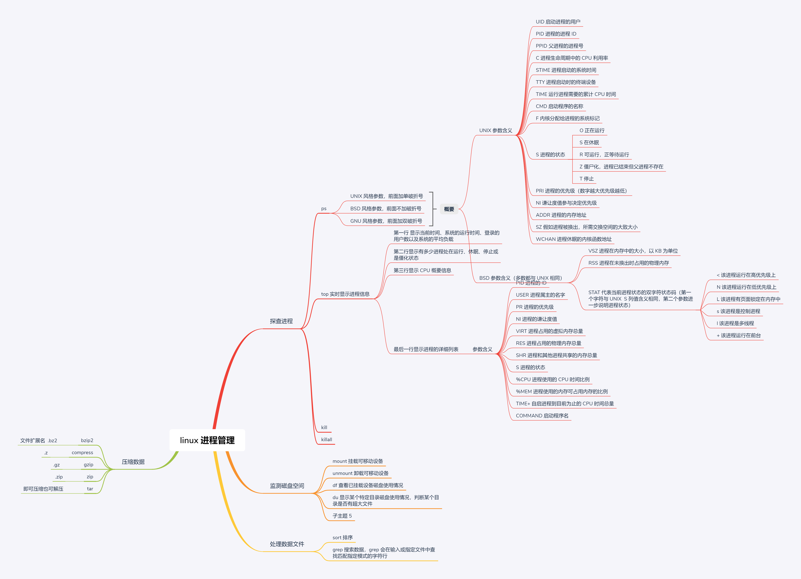

Linux 内核主要负责四个功能：

- 系统内存管理
- 软件程序管理
- 硬件设备管理，系统将硬件设备当成特殊的文件，称为设备文件
  - 字符型设备文件
  - 块设备文件
  - 网络设备文件
- 文件系统管理

一些 Linux 的发行版本用一个表来管理系统开机时需要自启的进程，在 Linux 系统上这个表通常位于 `/etc/inittab`

Ubuntu 则采用了 `/etc/init.d` ，这些脚本通过 `/etc/rcX.d` 目录下启动，X 表示运行级别

常见 Linux 目录

### 查看文件内容

#### Linux 进程信号

| 信号 | 名称 | 描述                         |
| ---- | ---- | ---------------------------- |
| 1    | HUP  | 挂起                         |
| 2    | INT  | 中断                         |
| 3    | QUIT | 结束运行                     |
| 9    | KILL | 无条件终止                   |
| 11   | SEGV | 段错误                       |
| 15   | TERM | 尽可能终止                   |
| 17   | STOP | 无条件停止运行，但不终止     |
| 18   | TSTP | 停止或暂停，但继续在后台运行 |
| 19   | CONT | 在 stop 或 tstp 之后恢复执行 |

**linux 进程管理**

#### 进程列表

`(pwd;ls;cd /etc;pwd)` 将一串命令放在一对括号内会形成一个进程列表。进程列表会生成一个子 shell 来执行对应的命令。

另一种分组是将命令放在花括号中 `{ command; }` 花括号进行命令分组不会像进程列表那样创建出子 shell

### 协程

coproc NAME command 

 会在后台生成一个子 shell，在子 shell 中执行命令

### 外部命令

外部命令程序通常位于`/bin、/usr/bin、/sbin、/usr/sbin`

当外部命令执行时，会创建一个子进程。这种操作被称为衍生（forking）。

当进程必须执行 fork 操作时，它需要花费时间和精力来设置新子进程的环境，所以外部命令是有代价的。

### shell 内建命令

内建命令已经和 shell 编译在一起，不需要借助外部程序文件来运行，`type` 命令了解命令是否是内建。

#### history

内建命令。命令历史记录文件被保存在 `$HOME/.bash_history`，需要注意的是 bash 命令的历史记录是先存放在内存中，当 shell 退出时才会被写入到历史文件中。

`history -a` 强制写入  `history -n` 更新历史记录

#### 登录 shell 会从 5 个不同的启动文件里读取命令：

- /etc/profile shell 默认主启动文件
- $HOME/.bash_profile
- $HOME/.bashrc
- $HOME/.bash_login
- $HOME/.profile

**tips：有些 Linux 发行版使用了可拆卸式认证模块，PAM 文件会在 bash shell 启动之前处理，这些文件中可能会包含环境变量。PAM 文件包括 /etc/environment 和 $HOME/.pam_environment**

### 默认文件权限

umask 命令创建文件和目录的默认权限

umask 使用八进制掩码设置文件的权限

| 权限  | 二进制 | 八进制 | 描述             |
| ----- | ------ | ------ | ---------------- |
| `---` | 000    | 0      | 没有任何权限     |
| `--x` | 001    | 1      | 只有执行权限     |
| `-w-` | 010    | 2      | 只有写入权限     |
| `-wx` | 011    | 3      | 有写入和执行权限 |
| `r--` | 100    | 4      | 只有读取权限     |
| `r-x` | 101    | 5      | 有读取和执行权限 |
| `rw-` | 110    | 6      | 有读取和写入权限 |
| `rwx` | 111    | 7      | 有全部权限       |

文件默认权限值是 666，目录默认权限值是 777