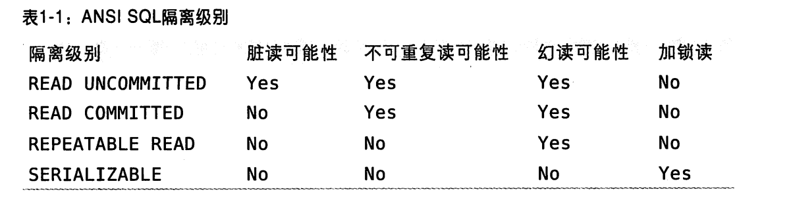
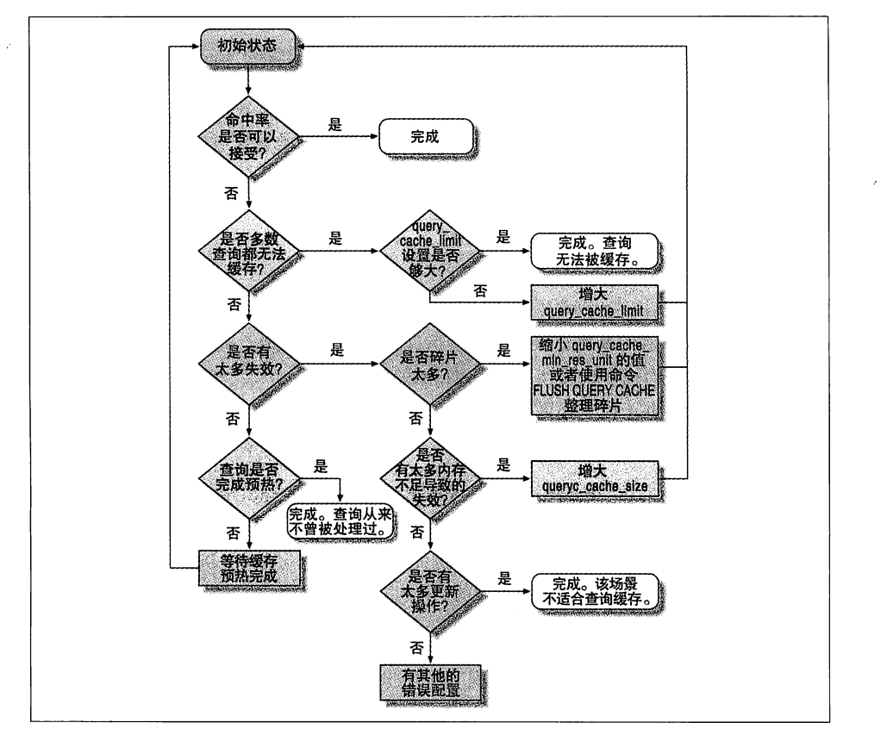

### 并发控制

处理并发读或者写时，可以通过实现一个由两种类型的锁组成的锁系统来解决问题。这两种类型的锁通常被称为共享锁（shared lock）和排他锁（exclusive lock），也叫读锁（read lock）和写锁（write lock）

##### 锁的概念：

读锁：读锁是共享的，也可以说是相互不阻塞的。多个用户再同一时刻可以同时读取同一个资源，而互不干扰。

写锁：写锁是排他的，一个写锁会阻塞其它的写锁和读锁，这是出于安全策略的考虑，只有这样，才能确保在给定的时间里，只有一个用户能执行写入，并防止其他用户读取正在写入的同一资源。

#### 锁粒度

一种提高共享资源并发性的方式让锁定对象更有选择性。尽量只锁定需要修改的部分数据，而不是所有资源。理想的方式是，只对会修改的数据片进行精确的锁定。任何时候，在给定的资源上，锁定的数据量越少，则系统的并发程度越高，只要相互之间不发生冲突即可。

问题是加锁也需要消耗资源。锁的各种操作，包括获得锁、检查锁是否已经解除、释放锁等，都会增加系统的开销。如果系统花费大量的时间来管理锁，而不是存取数据，那么系统的性能就会受到影响。

### 锁策略

是在锁的开销和数据的安全性之间寻求平衡，这种平衡也会影响到性能。

#### 表锁（table lock）

表锁是 MySQL 中的基本锁策略，并且是开销最小的策略。

表锁会锁定整张表，一个用户在对表进行写操作（插入、删除、更新等）前，需要先获得写锁，这会阻塞其他用户对该表的所有读写操作。只有没有写锁时，其他读取的用户才能获得读锁，读锁之间是不相互阻塞的。

写锁会比读锁有更高的优先级，因此一个写锁请求可能会被插入到读锁队列的前面（写锁可以插入到锁队列中读锁的前面，读锁则不能插入到写锁的前面）

**服务器会为 ALTER TABLE 之类的语句使用表锁，而忽略存储引擎的锁机制**

#### 行级锁（row lock）

行级锁可以最大程度的支持并发处理（同时也带来了最大的锁开销）

### 隔离级别

SQL 标准定义了四种隔离级别，每种级别都规定了一个事务中所作的修改，哪些在事务内和事务间是可见的，哪些是不可见的，较低级别的隔离通常可以执行更高的并发，系统的开销也更低。

- READ UNCOMMITTED（未提交读）
    - 在 READ UNCOMMITTED 级别，事务中的修改，即使没有提交，对其他事务也都是可见的。事务可以读取未提交的数据，这被称为脏读（drity read）。这个级别会导致很多问题，从性能上说，READ UNCOMMITTED 不会比其他的级别好，实际应用中一般很少使用。
- READ COMMITTED（提交读）
    - 大多数数据库系统的默认隔离级别是 READ COMMITTED（MySQL 不是）。READ COMMITTED 满足隔离性的简单定义，这个级别也叫做不可重复读（nonrepeatable read），因为两次执行同样的查询，可能会得到不一样的结果。
- REPEATABLE READ（可重复读）
    - 解决了脏读的问题。该级别保证了在同一个事务中多次读取同样的记录的结果是一致的。但在理论上，可重复读隔离级别还是无法解决另外一个幻读（Phantom Read）的问题。**幻读，指的是当某个事务在读取某个范围内的记录时，另外一个事务又在该范围内插入了新的记录，当之前的事务再次读取该范围的记录，会产生幻行（Phantom Row）**。此隔离级别是 MySQL 的默认事务隔离级别。
- SERIALIZABLE（可串行化）
    - SERIALIZABLE 是最高的隔离级别。它通过强制事务串行执行，避免了幻读问题。SERIALIZABLE 会在读取的每一行数据上都加上锁，所以可能导致大量的超时和锁争用问题。实际应用中很少用到这个隔离级别，只有在非常需要确保数据的一致性而且可以接受没有并发的情况下，才考虑该级别。

### 死锁

指两个或者多个事务在同一资源上相互占用，并请求锁定对方占用的资源，从而导致恶性循环的现象。当多个事务试图以不同的顺序锁定资源时，就可能会产生死锁。多个事务同时锁定同一个资源时，也会产生死锁。

案例：

> InnoDB  处理死锁的方式是将持有最少行级排他锁的事务进行回滚

### 事务日志

事务日志可以提高事务的效率。使用事务日志，存储引擎在修改表的数据时只需要修改其内存拷贝，再把该修改行为记录到持久在硬盘上的事务日志中，而不用每次都将修改的数据本身持久到磁盘。事务日志采用的追加方式，因此写日志的操作是磁盘上一小块区域内的顺序 I/O，而不像随机 I/O 需要在磁盘的多个地方移动磁头，所以采用事务日志的方式相对来说要快得多。事务日志持久后，内存中被修改的数据在后台可以慢慢刷回磁盘，称为预写式日志，修改数据需要写两次磁盘。

### InnoDB 存储引擎

InnoDB 是 MySQL 的默认事务引擎。他被设计用来处理大量的短期事务，短期事务大部分是正常提交，很少会被回滚。**InnoDB 的性能和自动崩溃恢复特性，使得它在非事务型存储的需求中也很流行**

## MySQL 基准测试

#### 名词解释

**吞吐量：单位时间内的事务处理数**

**响应时间或者延迟：用于测试任务所需的整体时间**

**并发性：在任意时间有多少同时发生的并发请求（错位的理解：经常会被表示成多少用户在同一时间浏览一个 Web 站点）**

**可扩展性：给系统增加一倍的工作，在理想的情况下可以获得两个结构（即吞吐量增加一倍），同时响应时间也必须在可接受范围**

## Schema 与数据类型优化

#### 选择优化的数据类型

1. 尽量使用可以正确存储数据的最小数据类型。更小的数据类型通常更快，因为它们占用更少的磁盘、内存和 CPU 缓存，并且处理时需要的 CPU 周期也更少。
2. 尽量避免 NULL ，MyISAM 中不推荐字段使用 null 值，在 InnoDB 中 null 值的影响较小

#### 整数类型

1. TINYINT ：8 位
2. SMALLINT：16 位
3. MEDIUMINT：24 位
4. INT：32 位
5. BIGINT：64 位

整数类型选择 UNSIGNED 属性，表示不允许负值，这可以使正数的上限提高一倍，例：UNSIGNED TINYINT 可以存储范围是 0 ~ 255，而 TINYINT 存储范围是 -128 ~ 127

MySQL 可以为整数类型指定宽度，例 INT(11)，这对大多数应用没有意义，它不会限制值的合法范围，只是规定了 MySQL 的一些交互工具用来显示字符的个数，对于存储和计算来说，INT(1) 和 INT(20) 是相同的。

#### 实数类型

**FLOAT**

**DOUBLE**

**DECIMAL** 类型进行计算时会转换为 DOUBLE 类型，只有在对小数进行精确计算时才使用 DECIMAL ，当在数据量比较大时，可以考虑使用 BIGINT （将需要存储的货币单位根据小数的位数乘以相应的倍数，例：0.01 乘以 100 即可），这样可以避免浮点存储计算不精确和 DECIMAL 精确计算代价高的问题

#### 字符串类型

字符串的 varchar(20) 是会限制数据的长度

**varchar** 不定长

**char** 定长

> MySQL 只对 BLOB 和 TEXT 每个列的最前 max_sort_length 字节排序而不是整个字符串

**TEXT** 字符集和排序规则

**BLOB** 二进制数据，没有排序规则或字符集

#### 时间和日期类型

**DATETIME** 能保存大范围的值，从 1001 到 9999 年，精度为秒，与时区无关，使用8字节存储空间

**TIMESTAMP** 保存范围小，从 1970 到 2038 年，与时区有关

#### 位数据类型

**BIT**

**SET**

### MySQL schema 设计陷阱

1. **太多的列**
    - MySQL 存储引擎 API 工作时需要在服务器层和存储引擎层之间通过行缓冲格式拷贝数据，然后在服务器层将缓冲内容解码成各个列。从行缓冲中将编码过的列转换成行数据结构的操作代价是非常高的。MyISAM 的定长行结构实际上与服务器层的行结构正好匹配。MyISAM 的变长行结构和 InnoDB 的行结构则总是需要转换。转换的代价依赖于列的数量。
2. **太多的关联**
    - MySQL 限制了每个关联操作最多只能有 61 张表，在关联了许多表的情况下，解析和优化查询的代价会成为 MySQL 的问题。如果希望查询执行的快速且并发性好，单个查询最好能在 12 个表以内做关联。

### 范式和反范式

#### 范式优缺点：

**优点**：

- 范式化的更新操作比反范式化要快
- 数据较好的范式化时，只有很少或者没有重复数据，只需要修改较少的数据
- 范式化的表通常更小，可以更好的放在内存中，所以执行操作会更快
- 很少有多余的数据意味着检索列表数据时更少需要 DISTINCT 或者 GROUP BY

**缺点**:

- 需要关联，在复杂一些的查询语句符合范式的 schema 上至少需要一次关联，这会是一些索引策略无效

#### 反范式的优缺点

**反范式化的 schema 因为所有数据都在一张表，可以很好的避免关联**

#### 混用范式化和反范式化

最常见的反范式化数据方法是复制或缓存，在不同的表中存储相同的特定列，可以使用触发器更新缓存值

#### 缓存表和汇总表

有时提升性能最好的方法是在同一张表中保存衍生的冗余数据，有时也需要创建一张完全独立的汇总表或缓存表。

缓存表和汇总表没有标准含义。

一般缓存表，用来表示存储那些可以比较简单的从 schema 其他表获取（但是每次获取速度比较慢）数据的表。

汇总表，保存的是使用 GROUP BY 语句聚合数据的表

### 创建高性能的索引

#### 索引的类型

##### B-TREE 索引

> 注意 B-Tree 索引需要按照顺序使用

B-Tree 索引适用如下：

- 全值匹配 ：指和索引中的所有列进行匹配
- 匹配最左前缀：只使用索引的第一列
- 匹配列前缀：指匹配某一列的值开头部分
- 匹配范围值
- 精确匹配某一列并范围匹配另外一列
- 只访问索引的查询

B-Tree 索引限制：

- 不按照索引的最左列开始查找，则无法使用索引
- 不能跳过索引中的列
- 如果查询中有某个列的范围查询，则其右边所有列都无法使用索引优化查找

##### 哈希索引

> 只有精确匹配索引所有列的查询才有效。对每一行数据，存储引擎都会对所有的索引列计算一个哈希码。哈希码是一个较小的值，并且不同的键值的行计算出来的哈希码也不一样。哈希索引将所有的哈希码存储在索引中，同时在哈希表中保存指向每个数据行的指针。

哈希索引的限制：

- 哈希索引只包含哈希值和行指针，而不存储字段值
- 哈希索引数据并不是按照索引值顺序存储，所以无法用于排序
- 哈希索引不支持部分索引列匹配查找，因为哈希索引始终是使用索引列的全部内容来计算哈希值
- 哈希索引只支持等值比较查询，包括 `=、in、<=>` 不支持任何范围查询，例：price > 100
- 哈希冲突（不同的索引列值却有相同的哈希值）。当出现哈希冲突的时候，存储引擎必须遍历链表中所有的行指针，逐行比较直到找到符合条件的行。

##### 空间数据索引 R-Tree

空间索引会从所有纬度来索引数据，查询时，可以有效的使用任意纬度来组合查询，必须使用 MySQL 的 GIS 相关函数来维护数据，MySQL 对 GIS 支持不完善，不推荐这种索引。

##### 全文索引

### 视图

视图的两种算法：合并算法、临时表算法 

explain 分析视图语句 （select_type = DERIVED）表示使用的临时表

##### 可更新视图

如果视图定义中包含 GROUP BY、UNION、聚合函数、以及其他一些特殊情况就不能被更新，**所有使用临时表算法实现的视图都无法被更新**

### 缓存

分析和配置缓存

