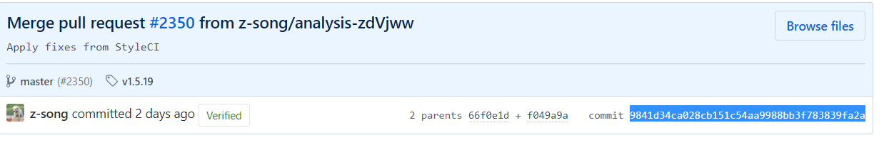
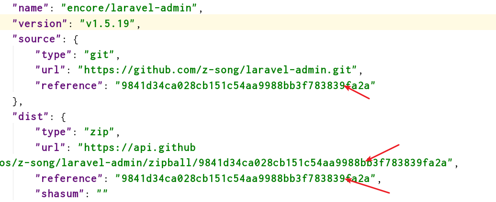

# Composer使用

1. composer self-update ：更新 composer 版本
2. composer install ： 安装当前目录下的 composer.json 文件内的东西
3. composer update ： 同一项目下需要安装新类库时
4. composer remove laravel/laravel : 删除类库
5. composer create-project laravel/laravel path 版本号 ： 创建项目

当遇到有的扩展包更新无效时，可以去 GitHub 上找到最新的 releases 版本 

选中蓝色部分复制到 `composer.lock` 文件中的对应的地方

然后执行 `composer install` 