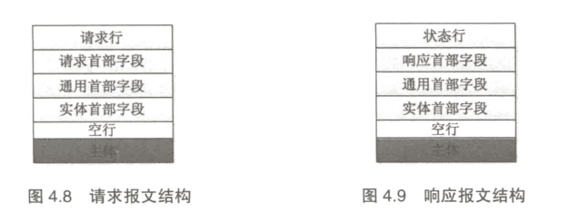

请求报文和响应报文：是由报文首部、空行和报文主体组成的

请求报文的首部又由请求行、请求首部字段、通用首部字段、实体首部字段组成。

响应报文的首部由状态行、响应首部字段、通用首部字段、实体首部字段组成。

HTTP 请求报文方法及其功能

| 方法名称 | 功能描述                       | 是否包含主体数据 |
| -------- | ------------------------------ | ---------------- |
| GET      | 从服务器获取文本               | 否               |
| POST     | 向服务发送客户端数据           | 是               |
| PUT      | 上传客户端的文件到服务器       | 是               |
| DELETE   | 从服务器上删除一个文件         | 否               |
| HEAD     | 只获取服务器响应的首部         | 否               |
| OPTIONS  | 获取服务器可以执行的方法       | 否               |
| TRACE    | 对经过代理服务器的报文进行追踪 | 否               |

通用首部字段

| 通用首部字段名    | 功能说明                                                     |
| ----------------- | ------------------------------------------------------------ |
| Connection        | 用于指定客户端/服务器间连接的选项，例如指定连续连接或通过 close 选项通知服务器在响应完成后关闭lianj |
| Date              | 报文创建的日期                                               |
| Transfer-Encoding | 指定报文主体数据的编码方式                                   |
| Update            | 发送端协议准备升级为新版本                                   |
| Via               | 报文经过中间节点（网关、代理等）的信息                       |
| Cache-Control     | 指定缓存行为                                                 |
| Warning           | 错误通知                                                     |

请求首部字段

| 请求首部字段名    | 功能说明                                                     |
| ----------------- | ------------------------------------------------------------ |
| Accept            | 客户端可处理的媒体                                           |
| Accept-Charset    | 客户端优先接受的字符集                                       |
| Accept-Encoding   | 客户端优先接受的编码方式，如 gzip                            |
| Accept-Language   | 客户端希望的语言种类                                         |
| Authorization     | 授权信息，通常用于对服务器发送的 WWW-Authenticate 首部进行应答 |
| Cookie            | 用于客户端向服务器发送一个令牌                               |
| Cookie2           | 用来说明客户端支持的 Cookie 版本                             |
| From              | 客户端的 E-mail 地址，由一些特殊的 Web 客户程序使用，浏览器不会 |
| Host              | 请求支援所在服务器的主机和端口                               |
| If-Modified-Since | 只有当所请求的内容在指定的日期之后又经过修改才返回它，否则返回 304 Not Modified 等 |
| Referer           | 包含一个 URL，客户端从该 URL 页面出发访问请求页面            |
| User-Agent        | 客户端信息，如客户端应用程序名称、版本等                     |
| UA-OS             | 客户端主机上的操作系统名称、版本等信息                       |
| UA-Pixels         | 客户端显示器像素信息                                         |

响应首部字段

| 响应首部字段名 | 功能含义                                            |
| -------------- | --------------------------------------------------- |
| Age            | 响应资源创建                                        |
| Set-Cookie     | 在客户端设置一个 Cookie，服务器用来对客户端进行标识 |
| Server         | 服务器应用程序软件的名称、版本等信息                |
| Retry-After    | 当资源不可用时，在此期间再次发送请求                |
| Refresh        | 表示浏览器应该在多长时间之后刷新文档，以秒计        |

实体首部字段

| 实体首部字段名   | 功能含义                                     |
| ---------------- | -------------------------------------------- |
| Allow            | 资源主体可以支持的                           |
| Content-Location | 通知接受端主体的 URL，用于接受端定位到该资源 |
| Content-Encoding | 主体适用的编码方式                           |
| Content-Language | 解释主体时适用的语言                         |
| Content-Length   | 主体的大小，通常以字节数表示                 |
| Content-MD5      | 主体的 MD5                                   |
| Content-Type     | 主体的对象类型                               |

