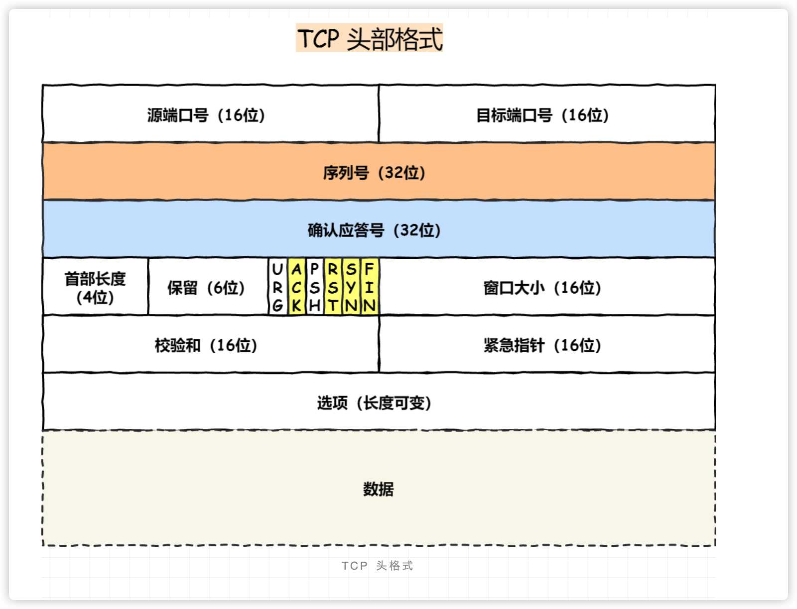
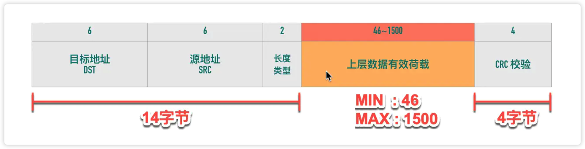
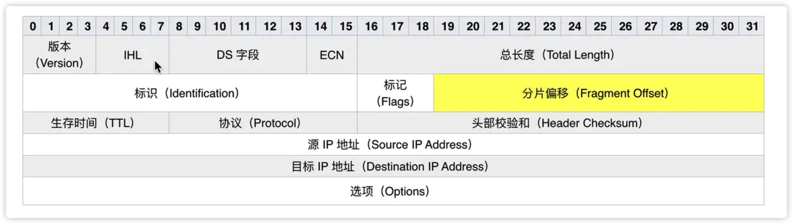

# TCP

TCP 工作在传输层的可靠数据传输服务，它能确保接收端接收的网络是无损坏、无间隔、非冗余和按序的。

TCP 是面向连接的、可靠的、基于字节流的传输层通信协议。

- 面向连接：一定是一对一连接，不能像UDP协议可以一个主机同时向多个主机发送消息
- 可靠的：无论网络链路中出现怎样的链路变化，TCP都可以保证一个报文一定能够到达接收端，主要有下面几个方面保证可靠性：
  - 对每个包提供检验和
  - 包的序列号解决了接收数据的乱序、重复问题
  - 超时重传
  - 流量控制、拥塞控制
- 字节流：消息是没有边界的，所以无论我们消息有多大都可以进行传输，并且消息是有序的，当前一个消息没有收到的时候，即使它先收到了后面的字节，也不能传给应用层，同时对重复的报文会自动丢弃。

建立一个TCP连接时需要客户端与服务器端达成三个信息的共识：

- Socket：由IP地址和端口号组成
- 序列号：解决乱序问题
- 窗口大小：流量控制

TCP 四元组可以确定一个唯一的连接：

- 源地址
- 源端口
- 目的地址
- 目的端口

源地址和目的地址的字段是在 IP 头部中，作用是通过 IP 协议发送报文给对方主机。

源端口和目的端口的字段是在 TCP 头部中，作用是告诉 TCP 协议应该把报文发给哪个进程

## TCP 头部格式



<font color="blue">校验和：</font>每个 TCP 包首部中都有两个字节用来表示校验和，防止传输过程中有损坏。如果收到一个校验和有差错的报文，TCP 不会发送任何确认直接丢弃它，等待发送端重传。

<font color="blue">序列号：</font>在建立连接时由计算机生成的随机数作为其初始值，通过SYN包传给接收端主机，每发送一次数据，就累加一次该数据字节数的大小。**用来解决网络包乱序问题。**

<font color="blue">超时重传：</font>TCP 发送数据后会启动一个定时器，等待对端确认收到这个数据包。如果在指定时间没有收到 ACK 确认，就会重传数据包，然后等待更长时间，如果还没有收到就再重传，在多次重传任然失败以后，TCP 会放弃这个包。

<font color="blue">确认应答号： </font>指下一次期望收到的数据序列号，发送端收到这个确认应答以后可以认为在这个序号以前的数据都已经被正常接收。**用来解决不丢包的问题。**

<font color="blue">控制位：</font>

- ACK：该位为1时，确认应答字段变为有效，TCP规定除了最初建立连接时的SYN包之外该位必须设置为1。
- RST：该位为1时，表示TCP连接中出现异常必须强制断开连接。
- SYC：该位为1时，表示希望建立连接，并在其序列号的字段进行序列号初始值的设定。
- FIN：该位为1时，表示不会再有数据发送，希望断开连接。当通信结束希望断开连接时，通信双方的主机之间就可以相互交换FIN位置为1的TCP段。

## UDP 和 TCP 的区别

UDP 不提供复杂的控制机制，利用 IP 提供面向无连接的通信服务


- 目标和源端口：告诉 UDP 协议应该把报文发给哪个进程
- 包长度：保存了 UDP首部的长度和数据长度之和
- 校验和：为了提供可靠的 UDP 首部和数据

### 区别

1. 连接
   - TCP 是面向连接的传输层协议，传输数据前要先建立连接
   - UDP 不需要连接，即可传输数据
2. 服务对象
   - TCP 是一对一服务
   - UDP 支持一对一、一对多、多对多服务
3. 可靠性
   - TCP 是可靠交付数据，数据可以无差错、不丢失、不重复、按需到达
   - UDP 是尽最大努力交付，不保证可靠交付数据
4. 拥塞控制、流量控制
   - TCP 有拥塞控制和流量控制机制，保证数据传输的安全性
   - UDP 没有，即使网络非常拥堵，也不会影响 UDP 的发送速率
5. 首部开销
   - TCP 首部长度较长，会有一定的开销，首部在没有使用选项字段时是 20 个字节，如果使用了选项字段则会变长。
   - UDP 首部只有 8 个字节，并且使固定不变的，开销较小

### 应用场景

TCP 要保证数据的可靠性交付：

- FTP 文件传输
- HTTP、HTTPS

UDP 随时可发送数据，本身处理简单又高效：

- 包总量较少，如 DNS、SNMP 等
- 视频、音频等多媒体通信
- 广播通信

### TCP 为什么需要三次握手

> TCP 的三次握手能防止历史连接的建立，减少双方不必要的资源开销，能帮助双方同步初始化序列号。
>
> 序列号能保证数据包不重复、不丢弃和按序传输。


#### 最大传输单元（Maximum Transmission Unit，MTU）

数据链路层传输的帧大小是有限制的，不能把一个太大的包直接塞给链路层，这个限制被称为 **MTU**。




上图是以太网的帧格式：

- 以太网的帧最小帧是 64 字节，除去 14 字节头部和 4 字节的 CRC 字段，有效载荷最小为 46 字节
- 最大帧是 1518 字节，除去 14 字节头部和 4 字节 CRC，有效载荷最大为 1500。

如果传输 100KB 的数据，至少需要（100*1024/1500）=69 个以太帧。

不同的数据链路层的 MTU 是不同的，`netstat -i` 可以查看网卡的 MTU

#### 最大段大小（Max Segment Size，MSS)

TCP 为了避免被发送方分片，会主动把数据分割成小段再交给网络层，最大的分段大小称之为 MSS。

```
MSS = MTU - IP header头大小 -  TCP头大小
```


## IP 分段

IPv4 数据包的最大大小为 65535 字节，当一个 IP 数据包大于 MTU 时，IP 会把数据报文进行切割为多个小的片段，使得这些小的报文可以通过链路层进行传输。

IP 头部有一个分片偏移量的字段，表示该分段在原始数据报文中的位置



