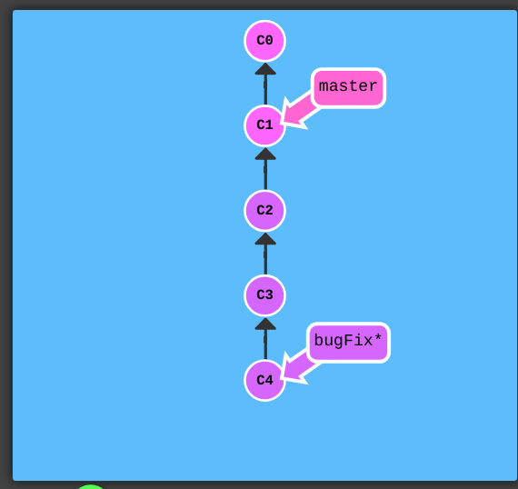
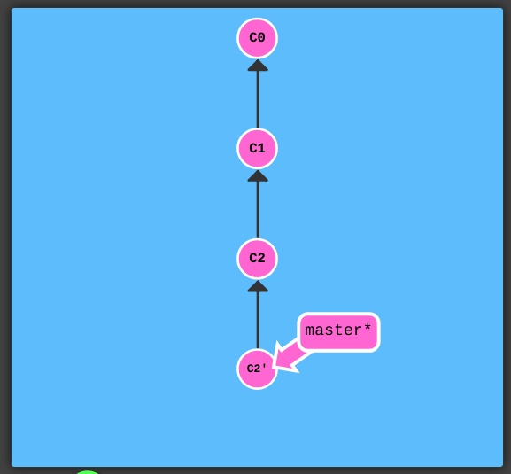
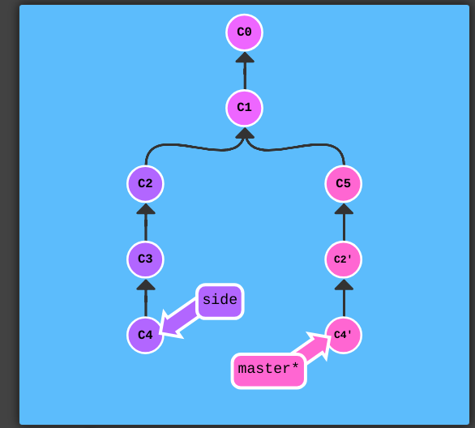
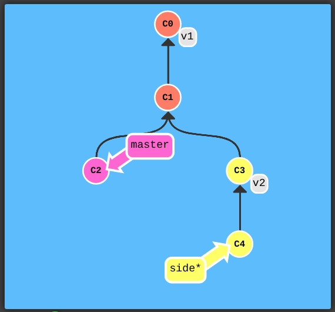

git rebase ref 创建一个线性提交，是将当前 HEAD 指向的提交移动到指定的 ref 下


git checkout HEAD^ 父级，HEAD 相当于指针，HEAD -> Branch Name -> commit

git branch -f  {Branch Name} HEAD~3 ：强制将分支移动到 c1 



## 撤销更改

git revert 实际是创建一个与上一个提交一样的新提交



这里使用 git revert HEAD^ 创建了一个 c2’ 的新提交，c2’ == c1


git reset 把分支记录回退几个提交记录来实现撤销修改


## 选择提交记录

git cherry-pick c2 c4

在 c5 处，使用了 cherry-pick 选择了 c2 c4 



### 交互式 rebase

git rebase -i HEAD~4 ：这样就会选择4个提交来进行位置的移动

### 标签 tag

git tag v1 c1

git describe \<ref\> 描述离你最近标签

> `<ref>` 输出结果是 `<tag>_<numCommits>_g<hash>`
>
> tag 表示的是离 ref 最近的标签
>
> numCommits 是表示这个 ref 与 tag 相差有多少个提交记录
>
> hash 表示的是给定 ref 提交记录哈希值的前几位
>
> 当 ref 提交记录上有某个标签时，则只输出标签名称



> git describe master 会输出：
>
> v1_2_gC2
>
> git describe side 输出：
>
> v2_1_gC4

# 远程仓库

git fetch：从远程仓库获取数据，fetch 不会改变本地仓库的状态，不会更新 master 分支，它只是将所有的数据都下载下来

当将远程分支的数据 fetch 下来后，可以使用：

```
git cherry-pick o/master
git rebase o/master
git merge o/master
```

也可以使用 git pull 命令

`git checkout -b slave o/master` 这个命令表示创建一个分支，并让这个分支跟踪远程 master 分支

`git branch -u o/master slave` 同上，如果此时就在 slave 分支上则可以省略 slave。

```
git push origin <source>:<destination> # 推送指定的源到指定的目的地
# 如
git push origin slave^:master # 这是将 slave 的父级推送到了 master 分支
```

```
git fetch origin <place>
# git 会到远程仓库的 <place> 分支获取本地不存在的提交，到 <o/place> 上

git fetch origin slave^:master
# 表示从远程分支的 slave 上获取父级提交更新到 master 分支上
```

**Tips：如果 source 不设置，如 git push origin :master 则表示删除master ，而 fetch 则相反，git fetch origin :slave 则会创建一个 slave 的本地分支**

