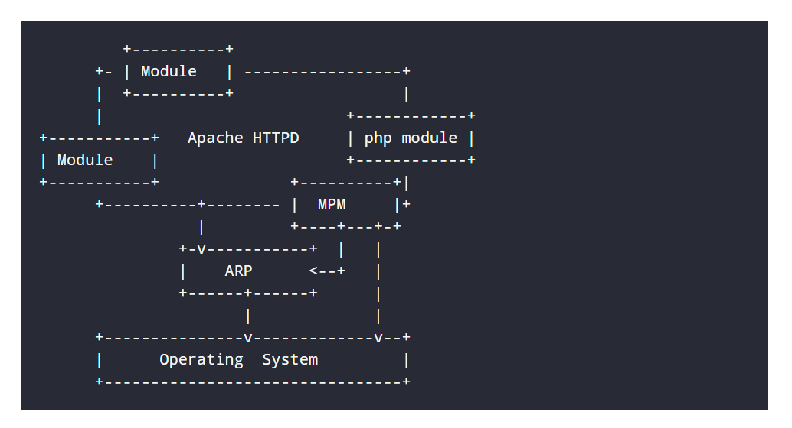
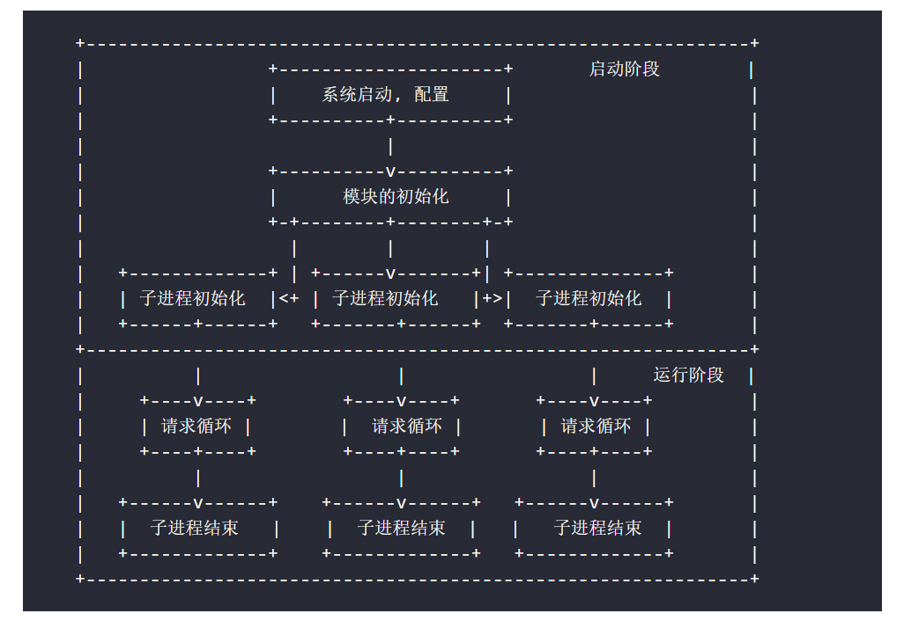
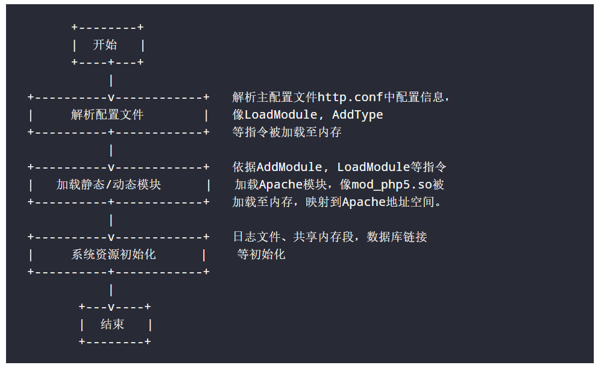
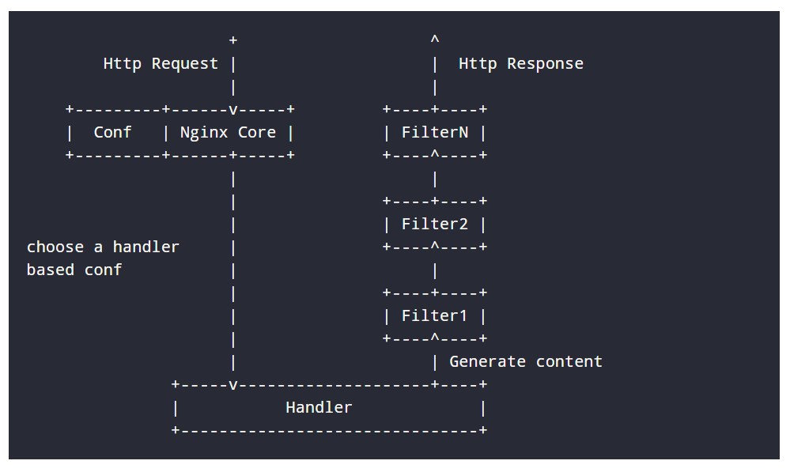
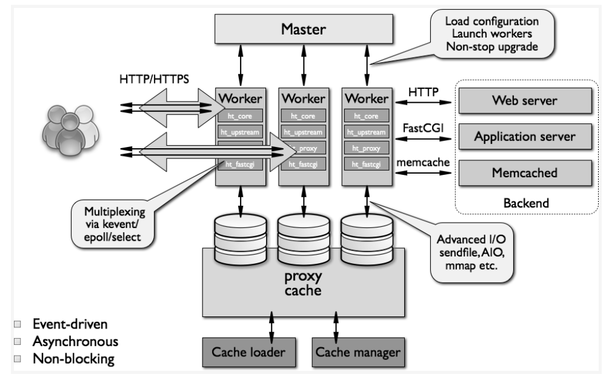

### Apache 和 Nginx 功能比较

- 在功能实现上，Apache 的所有模块都支持动、静态编译，而 Nginx 模块支持静态编译
- 对 FastCGI 的支持，Apache 对 FastCGI 的支持不好，而 Nginx 对 FastCGI 的支持非常好
- 在处理连接方式上，Nginx的 epoll 模型对静态请求的处理有很高的性能，而 Apache 的 select 模型对动态请求有较好的支持
- 在空间使用上，Nginx 安装包只有几百K，Apache则要大很多。

### Nginx 相对 Apache 的优点

- 轻量级，同样的 web 服务，比 Apache 占用更少的内存及资源
- 静态处理，nginx 静态处理性能比 Apache 高 3 倍以上
- 抗并发，nginx 处理请求是异步非阻塞的，Apache 是阻塞型，在高并发下 nginx 能保持低资源低消耗高性能。Apache + PHP （prefork）模式下，如果 PHP 处理慢或者前端压力很大的情况下，很容易出现 Apache 进程数飙升，从而拒绝服务的现象。
- 高度模块化设计，编写模块相对简单

### Apache 相对 nginx 的优点

- rewrite 比 nginx 的 rewrite 强大
- 模块很多
- 处理动态请求比 nginx 更稳定
- Apache 的 select 模型，如果只提供很少的静态服务，select 模型比 epoll 性能更高

### Nginx 优势所在

- 作为 web 服务器：nginx 处理静态文件、索引文件，自动索引的效率非常高
- 作为代理服务器：nginx 可以实现无缓存的反向代理加速，提高网站运行速度
- 作为负载均衡服务器：nginx 在内部就支持 Rails 和 PHP ，也支持 HTTP 代理服务器对外进行服务，同时还支持简单的容错和利用算法进行负载均衡
- 在性能方面，nginx 是专门为性能优化而开发的，在实现上非常注重效率。它采用内核 poll 模型（epoll and kqueue），可以支持更多的并发连接，最大可以支持 50000 个并发连接数而且占用内存很低
- 在高可用性方面，nginx 支持热部署，启动速度很快，因此可以在不间断服务的情况下，对软件版本或者配置进行升级，即使运行数月也无需重新启动，几乎可以做到 7x24 小时不间断运行

## Apache 工作流程

#### Apache 组件

Apache 是基于模块化设计的，核心代码不多，大多数功能都被分散到各个模块中，各个模块在系统启动的时候按需载入

MPM（Multi-Processing Modules，多重处理模块）是 Apache 的核心组件之一，Apache 通过 MPM 使用操作系统的资源，对进程和线程池进行管理。Apache 为了能够获得最好的运行性能，针对不同的平台做了优化，为不同的平台提供了不同的 MPM，其中最常用的 MPM 有 prefork 和 worker 两种。

#### Apache 生命周期

#### Apache 工作模式

##### prefork 工作原理

一个单独的控制进程（父进程）负载产生子进程。这些子进程用于监听请求并作出应答。Apache 总是试图保持一些备用的或是空闲的子进程留待备用。这样客户端就无需等候子进程产生。在 Unix 系统中，父进程通常以 root 身份运行以便绑定 80 端口，而 Apache 产生的子进程通常以一个低特权的用户运行。user 和 group 指令用于配置子进程的低特权用户。运行子进程的用户必须要对它所服务的内容有读取权限，对服务内容之外的其它资源必须拥有尽可能少的权限。

##### worker 工作原理

每个进程能够拥有的线程数量是固定的，服务器会根据负载情况增加或减少进程数量。一个单独的控制进程（父进程）负责子进程的建立。每个子进程能够建立一定的服务线程数量和一个监听线程，该监听线程监听接入请求并将其传递给服务器线程处理和应答。Apache 总是试图维持一个备用或是空闲的服务线程池，这样客户端无需等待新线程或新进程的建立即可得到处理。在 Unix 中，为了能够绑定 80 端口，父进程一般都是以 root 身份启动，Apache 以较低权限的用户建立子进程和线程。user 和 group 用于配置 Apache 子进程的权限。

### Apache 运行

在启动阶段，Apache 主要进行配置文件解析（http.conf以及 include）、模块加载（mod_php.so）和系统资源初始化（日志文件、共享内存段）。在这个阶段，Apache 为了获得系统最大的使用权限，将以超级管理员用户完成启动。

Apache将请求处理循环分为11个阶段，依次是：Post-Read-Request，URI Translation，Header Parsing，Access Control，Authentication，Authorization，MIME Type Checking，FixUp，Response，Logging，CleanUp

## Nginx

Nginx 由内核和模块组成。其中内核的设计非常微小和简洁，完成的工作也非常简单，仅仅通过查找配置文件将客户端请求映射到一个 location 中，而在这个 location 中所配置的每个指令将会启动不同的模块去完成相应的工作。

Nginx 的模块从结构上分为核心模块、基础模块和第三方模块：

- 核心模块：HTTP 模块、EVENT 模块和 Mail 模块
- 基础模块：HTTP Acccess 模块、HTTP FastCGI 模块、HTTP Proxy 模块和 HTTP Rewrite 模块
- 第三方模块：HTTP Upstream Request Hash 模块、Notice 模块和 HTTP Access Key 模块

Nginx 模块从功能上分为：

- Handlers（处理器模块）此类模块直接处理请求，并进行输出内容和修改 headers 信息等操作。Handlers 处理器模块一般只有一个。
- Filters（过滤器模块）。此类模块主要对其它处理器模块输出的内容进行修改操作，最后由 Nginx 输出
- Proxies（代理类模块）此类模块是 Nginx 的 HTTP Upstream 之类的模块。这些模块主要与后端的一些服务比如 FastCGI 等进行交互，实现服务代理和负载均衡等功能。

### Nginx 架构

