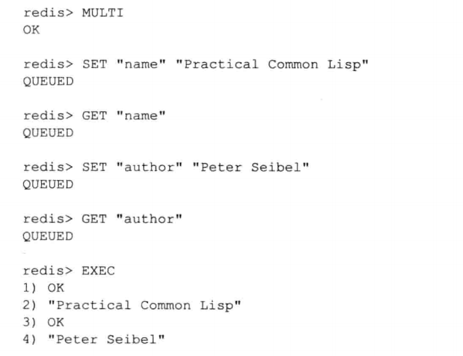

### 简单动态字符串 SDS

Redis 自己构建了一种简单动态字符串（simple dynamic string，SDS），并将 SDS 用作 Redis 的默认字符串表示。

1. 空间预分配

空间预分配用于优化 SDS 的字符串增长操作，当 SDS 的长度小于 1MB 。

​	例如：当 SDS 的 len 长度为 13 字节，那么程序也会分配 13 字节的未使用空间，SDS 的 buf 数组的实际长度将变成 13+13+1 字节的长度（额外一字节用于保存空字符），如果 SDS 的长度大于等于 1 MB，程序则会分配 1MB 的未使用空间，buf 的实际长度为 SDS长度 + 1MB + 1byte 。

空间预分配策略，减少了连续执行字符串增长所需的内存重分配次数。

2. 惰性空间释放

惰性空间释放用于优化 SDS 的字符串缩短操作，当 SDS 需要缩短 SDS 保存的字符串时，程序并不立即使用内存重分配来回收缩短后多出来的字节，而是使用 free 属性将这些字节数量记录起来，等待将来使用。

例如：原 SDS 共有字节数 11 ，当缩短了 8 后，这个 8 字节会被记录在 free 属性中。

##### SDS 的主要操作 API

| 函数        | 作用                                                         | 时间复杂度                               |
| ----------- | ------------------------------------------------------------ | ---------------------------------------- |
| `sdsnew`    | 创建一个包含给定 C 字符串的 SDS                              | O(N)，N 为给定 C 字符串的长度            |
| `sdsempty`  | 创建一个不包含任何内容的空 SDS                               | O(1)                                     |
| `sdsfree`   | 释放给定的 SDS                                               | O(N)，N 为被释放的 SDS 长度              |
| `sdslen`    | 返回 SDS 的已使用空间字节数                                  | O(1)                                     |
| `sdsavail`  | 返回 SDS 的未使用空间字节数                                  | O(1)                                     |
| `sdsdup`    | 创建一个给定 SDS 的副本                                      | O(N)，N 为给定 SDS 长度                  |
| `sdsclear`  | 清空 SDS 保存的字符串内容                                    | O(1)                                     |
| `sdscat`    | 将给定 C 字符串拼接到 SDS 字符串末尾                         | O(N)，N 为被拼接 C 字符串的长度          |
| `sdscatsds` | 将给定 SDS 字符串拼接到另一个 SDS 字符串末尾                 | O(N)，N 为拼接 SDS 字符串的长度          |
| sdscpy      | 将给定 C 字符串复制到 SDS 里面，覆盖 SDS 原有字符串          | O(N)，N 为被复制 C 字符串长度            |
| sdsgrowzero | 用空字符串将 SDS 扩展至给定长度                              | O(N)，N 为扩展新增的字节数               |
| sdsrange    | 保留 SDS 给定区间内的数据，不再区间内的数据会被覆盖或清除    | O(N)，N 为保留数据的字节数               |
| sdstrim     | 接受一个 SDS 和一个 C 字符串作为参数，从 SDS 中移除所有在 C 字符串中出现过的字符 | O($$N^2$$)                               |
| sdscmp      | 对比两个 SDS 字符串是否相同                                  | O(N)，N 为两个 SDS 中较短的那个 SDS 长度 |

### 链表 Linked List

Redis 链表实现特性：

- 双端：链表节点带有 prev 和 next 指针，获取某个节点的前置节点和后置节点复杂度都是 $$O(1)$$ 
- 无环：表头节点的 prev 指针和表尾节点的 next 指针都指向 NULL，对链表的访问以 NULL 为终点
- 带表头指针和表尾指针：通过 list 结构的 head 指针和 tail 指针，程序获取链表的表头节点和表尾节点的复杂度为 $$O(1)$$
- 带链表长度计数器：程序使用 list 结构的 len 属性来对 list 持有的链表节点进行计数，程序获取链表中节点数量的复杂度为 $$O(1)$$
- 多态：链表节点使用 void* 指针来保存节点值，并且可以通过 list 结构的 dup、free、match 三个属性为节点值设置类型特定函数，所以链表可以用于保存各种不同类型的值

### 字典 Dict

Redis 数据库就是使用字典来作为底层实现的

哈希表的扩展与收缩，当以下条件中任意一个被满足，程序自动开始哈希扩展：

1. 服务器目前没有执行 BGSAVE 或者 BGREWRITEAOF 命令，并且哈希表的负载因子大于等于 1。
2. 服务器目前没有执行 BGSAVE 或者 BGREWRITEAOF 命令，并且哈希表的负载因子大于等于 5。

> 哈希表的负载因子计算公式：load_factor = ht[0].used / ht[0].size

### 跳跃表 Skip List

Redis 有序集合使用跳跃表作为底层实现之一

每个跳跃表节点的层高都是 1 至 32 之间的随机数

在同一个跳跃表中，多个节点可以包含相同的分值，但每个节点的成员对象必须是唯一的

跳跃表中的节点按照分值大小进行排序，当分值相同时，节点按照成员对象的大小进行排序

### 整数集合 intset

集合键的底层实现之一，可以保存类型为 int16_t 、int32_t  、 int64_t 的整数值，并且保证集合中不会出现重复的元素。

整数集合会根据新添加的元素类型，改变这个数组的类型。

整数集合只支持升级操作，不支持降级操作

### 压缩列表 ziplist

压缩列表是列表键和哈希键的底层实现之一。当一个列表键只包含少量列表项，并且每个列表项要么就是小整数值，要么就是长度比较短的字符串，那 Redis 就会使用压缩列表

##### 压缩列表节点构成

**字节数组：**

- 长度小于等于 $64(2^6-1)$ 字节的字节数组
- 长度小于等于 $16383(2^14-1)$ 字节的字节数组
- 长度小于等于 $4294967295(2^{32}- 1)$ 字节的字节数组

**整数值：**

- 4 位长，介于 0 至 12 之间的无符号整数
- 1 字节长的有符号整数
- 3 字节长的有符号整数
- int16_t 类型整数
- int32_t 类型整数
- int64_t 类型整数

### 对象

Redis 数据库以对象的形式实现，键一直是字符串对象，值可以是字符串对象、列表对象、哈希对象、集合对象、有序集合对象其中的一种


## 数据库

初始化服务器时，就会根据服务器状态的 dbnum 属性决定创建多少个数据库，默认为 16 个

切换数据库 ：`select 数字`

设置键的过期时间：

- `EXPIRE key  ttl` ：将键 key 的生存时间设置为 ttl 秒
- `PEXPIRE key ttl` ：将键 key 的生存时间设置为 ttl 毫秒
- `EXPIREAT key timestamp`：将键 key 的过期时间设置为 timestamp 指定的毫秒数时间戳
- `PEXPIREAT key timestamp`：将键 key 的过期时间设置为 timestamp 指定的毫秒数时间戳

返回键的剩余生存时间：`TTL key,PTTL key`

移除过期时间：`PERSIST key`

**过期键删除策略**

- 定时删除：设置键的的过期时间同时创建一个定时器
    - 优点：节约内存
    - 缺点：对 CPU 时间不友好，在过期键较多的情况下，删除过期键会占用相当一部分的 CPU 时间，影响服务器的响应时间和吞吐量

- 惰性删除：每次从键空间中获取键时，都检查取得键是否过期，过期删除，反之。
    - 优点：CPU 时间友好，该策略不会再删除其他无关的过期键上花费任何 CPU 时间
    - 缺点：浪费太多内存，有内存泄露的危险
- 定期删除：每隔一段时间，程序对数据库进行检查，删除里面的过期键。前两种策略的折中

#### AOF、RDB 和复制功能对过期键的处理

**生成 RDB 文件**

执行 SAVE 或者 BGSAVE 创建一个新的 RDB 文件，程序会对数据库中的键进行检查，已过期的键不会被保存到新建的 RDB 文件中。

**载入 RDB 文件**

在启动 Redis 服务器时，如果开启了 RDB 功能，服务器会对 RDB 文件进行载入：

- 服务器以主服务器模式运行，在载入 RDB 文件时，程序会对文件中保存的键进行检查，未过期的键会被载入到数据库中，过期键则会被忽略。
- 服务器以从服务器模式运行，在载入 RDB 文件时，文件中保存的所有键，不论是否过期，都会被载入到数据库中。当主从服务器进行数据同步的时候，从服务器的数据库就会被清空。

**AOF 文件写入**

当服务器以 AOF 持久化运行时，如果数据库中的某个键已经过期，但还没有被删除，那么 AOF 文件不会因这个过期键产生影响，当过期键被删除时，程序会向 AOF 文件追加一条 DEL 命令，显式的记录该键已被删除。

**AOF 重写**

执行 AOF 重写过程中，程序会对数据库中的键进行检查，已过期的键不会被保存到重写后的 AOF 文件中。

**复制**

当服务器运行在复制模式下时，从服务器的过期键删除动作由主服务器控制：

- 主服务器在删除一个过期键之后，会显式的向所有从服务器发送一个 DEL 命令，告知从服务器删除这个过期键
- 从服务器在执行客户端发送的读命令时，即时碰到过期键也不会将过期键删除，而是继续像处理未过期的键一样处理过期键。
- 从服务器只有在接到主服务器发来的 DEL 命令之后，才会删除过期键

#### RDB 持久化

通过保存数据库中的键值对来记录数据库状态不同

**RDB 文件创建与载入**

- 生成 RDB 文件的两个命令：
    - SAVE：会阻塞 Redis 服务器进程，直到 RDB 文件创建完毕，期间不会处理任何命令请求
    - BGSAVE：会派生出一个子进程，由子进程负责创建 RDB 文件，父进程继续处理请求

因为 BGSAVE 命令不会阻塞服务器进程，Redis 允许用户通过服务器配置 save 选项

例：

```
save 900 1	// 服务器在 900 秒内，对数据库进行了至少 1 次修改
save 300 10	// 服务器在 300 秒内，对数据库进行了至少 10 次修改
save 60 10000	// 服务器在 60 秒内，对数据库进行了至少 1000 次修改
```

#### AOF 持久化

通过保存 Redis 服务器所执行的写命令来记录数据库状态

AOF 持久化实现分为：命令追加（append）、文件写入、文件同步（sync）三个步骤

##### 命令追加

当 AOF 持久化功能处于打开状态，服务器在执行完一个写命令之后，会以协议格式将被执行的写命令追加到服务器状态的 aof_buf 缓冲区的末尾

appendfsync 选项值：

- always：将 aof_buf 缓冲区的所有内容写入并同步到 AOF 文件。**安全性最高，效率最慢，只会丢失一个事件循环产生的命令数据**
- everysec：将 aof_buf 缓冲区中的所有内容写入到 AOF 文件，如果上次同步 AOF 文件时间距离现在超过一秒钟，将再次对 AOF 文件进行同步，这个同步操作是由一个线程单独负责执行 **效率最高，只会丢失一秒钟的命令数据**
- no：将 aof_buf 缓冲区中所有内容写入到 AOF 文件，但不对 AOF 文件进行同步，同步由操作系统决定 **效率最高，会丢失上次同步 AOF 文件之后的所有写命令数据**

##### AOF 文件重写

为了解决 AOF 文件体积膨胀问题，AOF 重写，Redis 会创建一个新的 AOF 文件来替代现有 AOF 文件

- AOF 文件中所有命令都以 Redis 命令请求协议的格式保存
- 命令请求会先保存到 AOF 缓冲区里面，之后再定期写入并同步到 AOF 文件
- AOF 重写是通过读取数据库中的键值对来实现的，程序无须对现有 AOF 文件进行任何读入、分析或者写入操作

### 事件

##### 文件事件

##### 事件事件

## 多机数据库的实现

### 复制

部分重同步：

- 主服务器的复制偏移量和从服务器的复制偏移量
- 主服务器的复制积压缓冲区
- 服务器的运行 ID

##### 复制偏移量

执行复制的双方——主服务器和从服务器会分别唯一个复制偏移量

##### 复制积压缓冲区

复制积压缓冲区是由主服务器维护的一个固定长度先进先出队列，默认大小为 1MB

Tips：固定先进先出队列含义为，当队列长度被填满，先进的数据会被弹出

##### 服务器运行 ID

当从服务器初次复制时，主服务器就会发送自己的运行 ID 给从服务器，从服务器会保存下来

### 集群

##### 节点

连接节点 `cluster meet ip port`

##### 槽指派

Redis 集群通过分片的方式来保存数据库中的键值对：集群的整个数据库被分为 16384个 槽（slot），数据库中的每个键都属于整 16384 个槽的其中一个，集群的每个节点可以处理 0 个或最多 16384 个槽。

当数据库中的 16384 个槽都有节点在处理时，集群处于上线状态（ok），如果数据库中有任何一个槽没有得到处理，那么集群处于下线状态（fail）

`cluster addslots <slot> [slot]` 例：`cluster addslots 0 1 2 3 4 .... 5000`  给当前节点分配槽

##### 复制与故障转移

设置从节点：`cluster replicate node_id`

### 发布与订阅

##### 频道的订阅与退订

`subscribe channel` 

`unsubscribe channel`

##### 模式的订阅与退订

`psubscribe channel_pattern` 例：`psubscribe "new.*"`

`punsubscribe channel_pattern` 

##### 查看订阅消息

`pubsub channels pattern` 

- 如果不给定 pattern 参数，返回服务器当前被订阅的所有频道
- 给定 pattern 参数，返回服务器当前被订阅的频道中那些与 pattern 模式相匹配的频道

`pubsub numsub channel` 返回频道订阅者数量  

`pubsub numpat` 返回服务器被订阅模式数量

### 事务

Redis 通过 MULTI、EXEC、WATCH 等命令来实现事务。事务提供一种将多个命令请求打包，然后一次性、按顺序执行多个命令的机制，并且在事务执行期间，服务器不会中断事务而改去执行其他客户端的命令请求，会将事务中的所有命令都执行完毕，然后才去处理其他客户端的命令请求。

事务执行过程如下：



### 事务的 ACID 性质

**Redis 事务与传统关系型数据库事务的最大区别在于，Redis 不支持事务回滚机制**

**原子性**：指的是数据库将事务中的多个操作当作一个整体来执行，服务器要么就执行事务中的所有操作，要么一个也不执行

**一致性：**事务一致性指的是，如果数据库在执行事务之前是一致的，在事务执行之后无论事务是否执行成功，数据库也应该仍然一致。**一致指的是数据符合数据库本身的定义和要求，没有包含非法或者无效的错误数据。**

**隔离性：** 指的是数据库中有多个事务并发地执行，各个事务之间也不会互相影响，并且在并发状态下执行的事务和串行执行的事务产生的结果完全相同

**耐久性：**指的是当一个事务执行完毕时，执行这个事务所得的结果已经被保存到永久性存储介质里，即使服务器在事务执行完毕之后停机，执行事务所得的结果也不会丢失

### 排序

Redis 的 sort 命令可以对列表键、集合键或者有序集合键的值进行排序

- 默认情况下，SORT 排序键包含的都是数字值，并以数字值方式排序
- SORT 使用 ALPHA 选项，会以字符串方式排序
- 使用 BY 选项，使用其他键的值作为权重来进行排序操作
- GET 选项，会根据排序结果集中的元素，以及 GET 选项给定的模式，查找并返回其他键的值，而不是返回被排序的元素
- STORE 选项，会将排序结果集保存在指定的键里面

### 二进制位数组

`setbit x 0 1` 用于为位数组指定偏移量上的二进制位设置值，位数组的偏移量从 0 开始计数

`getbit x 3` 获取位数组指定偏移量上的二进制位的值

`bitcount x` 攻击位数组里面，值为 1 的二进制位的数量

`bitop and name x y z`  可以对多个位数组进行按位与（and）、按位或（or）、异或（xor）取反（not）运算

### 慢查询日志

记录执行时间超过给定时长的命令请求

相关配置选项：

- `slowlog-log-slower-than` 指定执行时间超过多少微秒的请求会被记录到日志上
- `slowlog-max-len` 指定服务器最多保存多少条慢查询日志