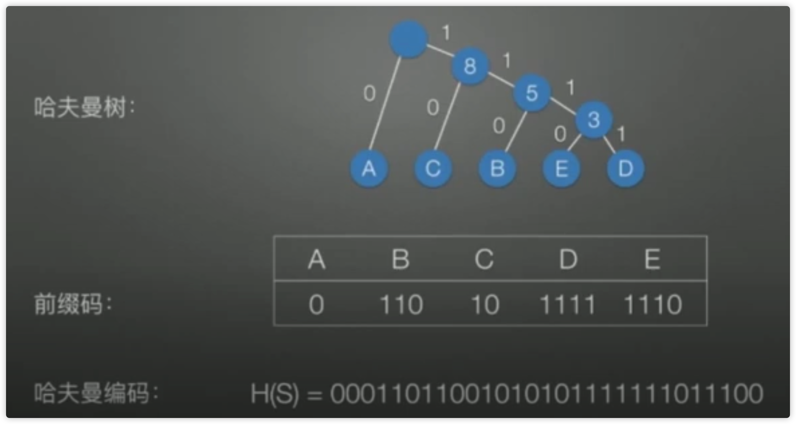

## 树(Tree)的定义

树（Tree）是 n（n>=0) 个节点的有限集。当 n = 0 时成为空树，在任意一棵非空树种：

- 有且仅有一个特定的称为根（Root）节点
- 当 n > 1时，其余节点可分为 m（m>0) 个互不相交的有限集 T1、T2、。。。。Tm，其中每一个集合本身又是一棵树，并且称为根的子树（SubTree）

节点拥有的子树数称为节点的度（Degree）。

- 度为 0 的节点称为叶节点（Leaf）或终端节点。
- 度不为 0 的节点称为分支节点或非终端节点，除根节点外，分支节点也称为内部节点。
- 节点的子树的根称为节点的孩子（Child），相应的，该节点称为孩子的双亲（Parent），同一双亲的孩子之间互称为兄弟（Sibling）。
- 树中节点的最大深度称为（Depth）。
- 将树中节点的各个子树看成从左至右是有次序的，不能互换的，则称该树为有序树，否则称为无序树。
- Forest 是 m(m>0) 棵互不相交的树的集合。对树中每个节点而言，其子树的集合即为森林。

### 二叉树的性质

1. 在二叉树的第i层上至多有$2^{i-1}$结点，如：第1层有 $2^{1-1}=1$，第二层有 $2^{2-1} = 2$
2. 深度为k的二叉树最多有$2^{k}-1 个结点$
3. 对任何一棵二叉树T，如果其终端结点数为$n_0$，度为2的结点数为$n_2$，则 $n_0=n_2+1$

总分支数 = 总节点数 - 1；

叶子节点树为 N0；单叶分支节点数为 N1；双分支节点数为 N2；

总节点数 = N0 + N1 + N2

总分支数 = N1 + 2N2

叶子节点数 = N2 + 1

空指针个数  = 总结点数 + 1

父节点位置为 i，左孩子节点位置为 2i+1，右孩子节点位置为 2i+2，**只适合完全二叉树**

### 树的遍历

深度优先遍历：

- 先序遍历：先访问根节点，然后先序遍历左子树，最后先序遍历右子树
- 中序遍历：先中序遍历左子树，然后访问根节点，最后中序遍历右子树  **普通树没有中序**
- 后序遍历：先后序遍历左子树，然后后序遍历右子树，最后访问根节点

### 哈夫曼树

常用于不定长编码

定义：

- 路径：指从树中一个节点到另一个节点的分支所构成的路线

- 带权路径长度：节点具有权值（每个字符出现的次数），从该节点到根路径的长度乘以节点的权值，就是该节点的带权路径长度，例：E 的带权路径长度为：4（路径长度） * 2（权值） =  8

- 树的带权路径长度（WPL）：指树中所有叶子节点的带权路径长度之和

哈夫曼二叉树的特点：

  - 权值越大的节点，距离根节点越近
  - 树中没有度为 1 的节点，这类树叫做严格二叉树
  - 树的带权路径长度最短

  

