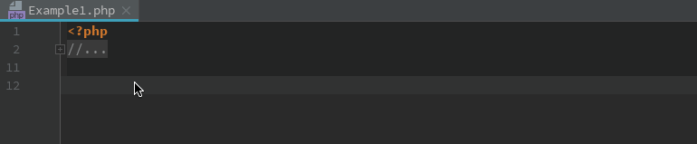
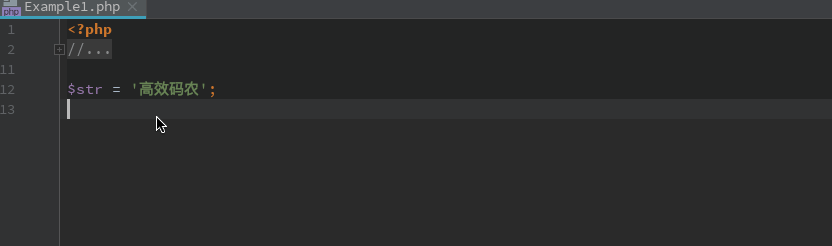
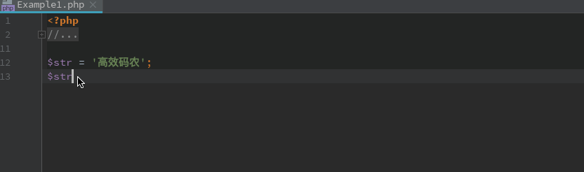
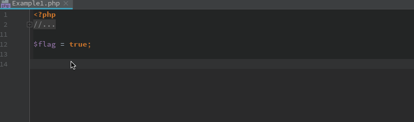
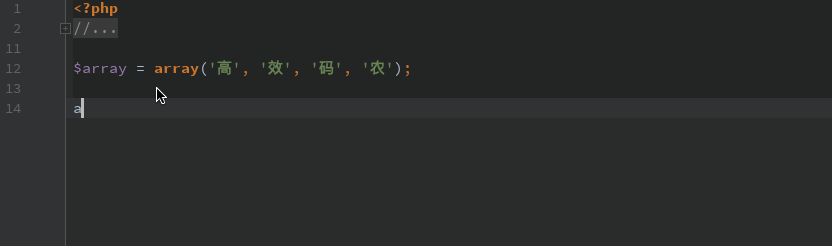

|      快捷键       |          说明          |
| :---------------: | :--------------------: |
|   ctrl+shift+N    |        查找文件        |
|     ctrl+f12      |   查看当前文件的方法   |
|      ctrl+e       |  查看当前编辑过的文件  |
| ctrl+shfit+insert | 在当前文件夹内创建文件 |
|   ctrl+shift+L    |       代码格式化       |
| ctrl+shift+alt+T  |      代码片段重构      |
|       alt+j       |          选中          |
|    alt+shift+j    |        撤销选中        |
| alt+ctrl+shift+j  |        全部选中        |
|                   |                        |
|                   |                        |
|                   |                        |
|                   |                        |
|                   |                        |

### 后缀补全

**var 声明**

**null 判控**

**not null 判非空**

**nn 判非空**

**not 取反**

**if 条件判断**

