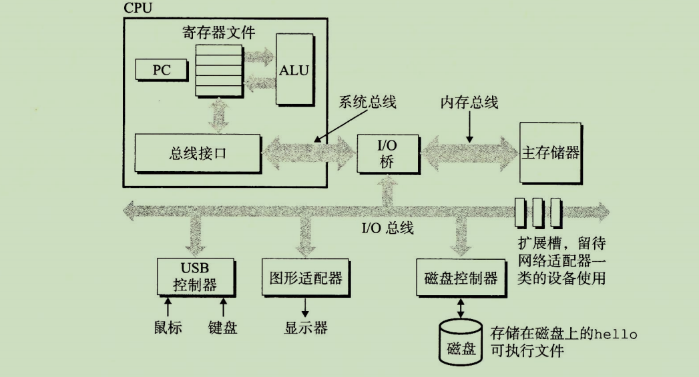
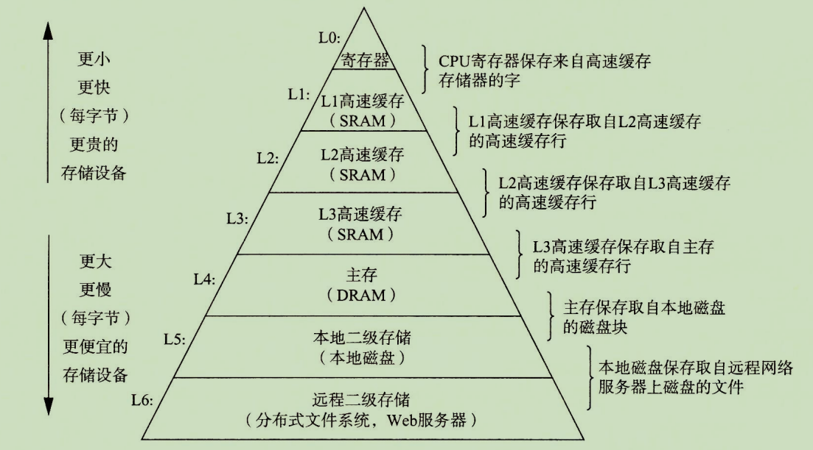
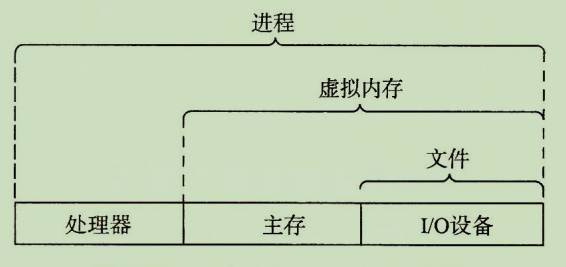
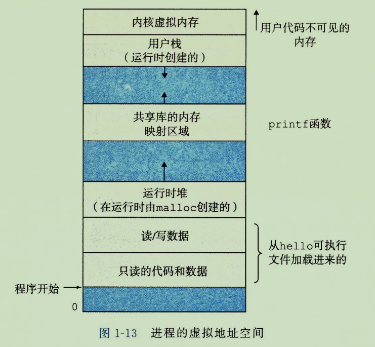
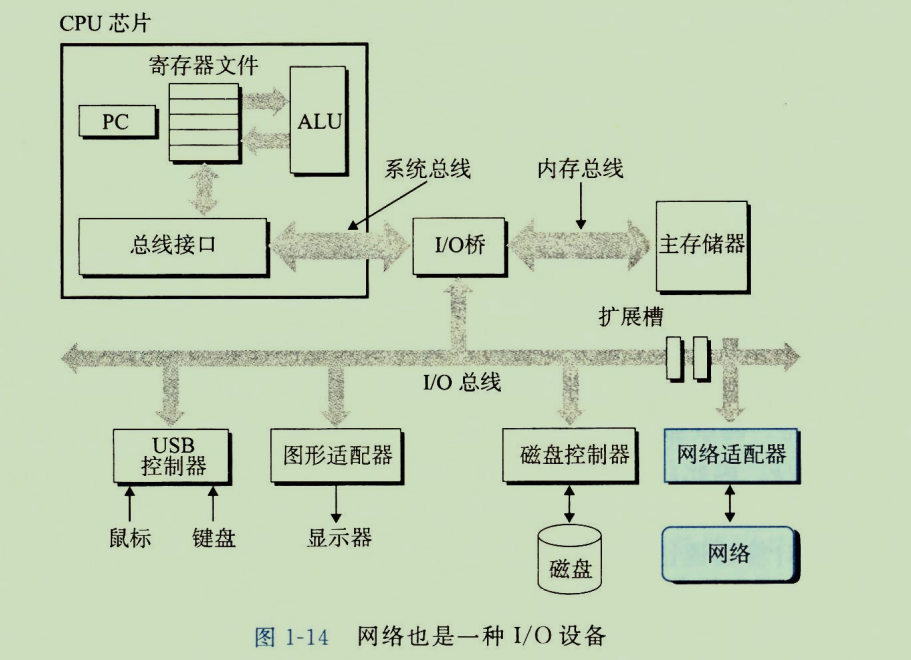

位：由 0 和 1 组成，也被称为比特（byte）。

字节：由8个位组成一组，每个字节表示程序中的某些文本字符。

### 系统硬件的组成

- 总线：贯穿整个系统的是一组电子管道，称为总线。它携带信息字节并负责在各个部件间传递。通常总线被设计成传送定长的字节块，也就是字（word）。字中的字节数（即字长）是一个基本的系统参数。各个系统字长都不一样，字长为 4 个字节的是 32 位系统，为 8 个字节的是 64 位系统。

- I/O 设备：I/O 设备是系统与外部世界的联系通道。

  示例图中有4个I/O 设备：

  - 用户输入的键盘和鼠标
  - 用户输出的显示器
  - 一个用于长期储存数据和程序的磁盘驱动器（磁盘）

  每个 I/O 设备都通过一个控制器或适配器与 I/O 总线相连。控制器与适配器之间的区别主要在于它们的封装方式。它们的功能都是在 I/O 总线和 I/O 设备之间传递信息。

  - 控制器是 I/O 设备本身或者系统的主印制电路板（也被称为主板）上的芯片组。
  - 适配器则是一个插在主板插槽上的卡。

- 主存：是一个临时存储设备，在处理器执行程序时，用来存放程序和程序处理的数据。从物理上来说，主存是由一组动态随机存取存储器（DRAM）芯片组成的。从逻辑上来讲，存储器是一个线性的字节数组，每个字节都有其唯一的地址（数组索引），这些地址是从零开始的。一般来说，组成程序的每条机器指令都由不同数量的字节构成。

- 处理器：中央处理单元（CPU），简称处理器，是解释（或执行）存储在主存中指令的引擎。**处理器的核心是一个大小为一个字的存储设备（或寄存器）**，被称为程序计数器（PC）。在任何时刻，PC 都指向主存中的某条机器语言指令（即含有该条指令的地址）。

    从系统通电开始，直到系统断电，处理器一直在不断的执行程序计数器指向的指令，再更新程序计数器，使其指向下一条指令。处理器看上去是按照一个非常简单的指令执行模型来操作的，这个模型是由**指令集架构决定的**。在这个模型中，指令按照严格的顺序执行，而执行一条指令包含执行一系列的步骤。处理器从程序计数器指向的内存出读取指令，解释指令中的位，执行该指令指示的简单操作，然后更新 PC，使其指向下一条指令，而这条指令并不一定和在内存中刚刚执行的指令相邻。

    处理器看上去是它的指令集架构的简单实现，但是实际上现代处理器使用了非常复杂的机制来加速程序的执行。因此将处理器的指令集架构和微体系结构区分开来：

  - 指令集架构描述的是每条机器代码指令的效果。
  - 微体系结构描述的是处理器实际上是如何实现的。

### 高速缓存

  对于处理器而言，从磁盘驱动器（磁盘）上读取一个字的事件开销要比从主存中读取的开销大 1000 万倍，然而从寄存器文件中读取数据要比从主存中读取几乎要快 100 倍，但是寄存器只存储几百字节的信息，主存里可存放几十亿字节。

  针对这种处理器与主存之间的差异，使用了一种更小更快的存储设备，称为高速缓存存储器（cache memory），简称 cache 或高速缓存，作为暂时的集结区域，存放处理器近期可能会需要的信息。

### 存储器设备形成层次结构

在处理器和一个较大较慢的设备之间插入一个更小更快的存储设备的想法已经成为一个普遍的观念。每个计算机系统中的存储设备都被组织成了一个**存储器层级结构**。存储器层次结构的主要思想是上一层的存储器作为第一层存储器的高速缓存。

在上图的层次结构中，从上至下，设备的访问速度越来越慢，容量越来越大，并且每字节的造价也越来越便宜。

### 操作系统管理硬件

计算机系统分层

操作系统是应用程序和硬件之间被插入的一层软件，所有应用程序对硬件的操作尝试都必须通过操作系统。

操作系统的两个基本功能：

- 防止硬件被失控的应用程序滥用。
- 向应用程序提供简单一致的机制来控制复杂而又通常大不相同的低级硬件设备。

操作系统抽象层表示

操作系统通过几个基本的抽象概念：进程、虚拟内存和文件，来实现这两个功能。

- 文件是对 I/O 设备的抽象表示。
- 虚拟内存是对主存和磁盘 I/O 设备的抽象表示。
- 进程是对处理器、主存和 I/O 设备的抽象表示。

#### 进程

进程是操作系统对一个正在运行的程序的一种抽象。在一个系统上可以同时运行多个进程，而每个进程都好像在独占的使用硬件。**并发运行，是说一个进程的指令和另一个进程的指令是交错执行的。**在大多数系统中，需要运行的进程数是可以多于运行它们的 CPU 个数的。无论是在单核还是多核系统中，一个 CPU 看上去都像是在并发的执行多个进程，这是通过处理器在进程间切换来实现的。操作系统实现这种交错执行的机制称为**上下文切换**。

操作系统保持跟踪进程运行所需的所有状态信息，这种状态，称之为**上下文**。包含许多信息，如 PC 和寄存器文件的当前值，以及主存的内容。在任何一个时刻，单处理器系统都只能执行一个进程的代码，当操作系统决定要把控制权从当前进程转移到某个新进程时，就会进行**上下文切换**，即保存当前进程的上下文，恢复新进程的上下文，然后将控制权传递给新进程，新进程就会从它上次停止的地方开始。

#### 线程

在现代系统中，一个进程可以由多个线程组成，每个线程都运行在进程的上下文中，并共享同样的代码和全局数据。

#### 虚拟内存

虚拟内存是一个抽象的概念，它为每个进程提供了一个假象，即每个进程都在独占的使用主存。每个进程看到的内存都是一致的，称为虚拟地址空间。

上图所示的是 linux 进程的虚拟地址空间，最上面的区域是保留给操作系统中的代码和数据的，这对所有进程都是一样的，地址空间的底部区域是存放用户进程定义的代码和数据的。图中的地址是从下往上增大的。

每个进程看到的虚拟地址空间由大量准确定义的区构成，每个区都有专门的功能。从最低的地址开始：

- 程序代码和数据：对所有进程来说，代码是从同一固定地址开始，紧接的是和 C 全局变量相对应的数据位置。代码和数据区是直接按照可执行目标文件的内容初始化的。
- 堆：代码和数据区后紧随着的是运行时堆。代码和数据区在进程一开始运行时就确定了大小，但当调用像malloc 和 free 这样的 C 标准库函数时，堆可以在运行时动态的扩展和收缩。
- 共享库：大约在地址空间的中间部分是一块用来存放像 C 标准库和数学库这样的共享库的代码和数据区域。
- 栈：位于用户虚拟地址空间顶部的是用户栈，编译器用它来实现函数调用。和堆一样，用户栈在程序执行期间可以动态的扩展和收缩。每当我们调用一个函数时，栈就增长，从一个函数返回时，栈就会收缩。
- 内核虚拟内存：地址空间顶部的区域是为内核保留的。不允许应用程序读写这个区域的内容或者直接调用内核代码定义的函数。它们必须由内核来执行这些操作。

虚拟内存的运作是硬件和操作系统软件之间精密复杂的交互，包括对处理器生成的每个地址的硬件翻译。基本思想是把一个进程虚拟内存的内容存储在磁盘上，然后用主存作为磁盘的高速缓存。

#### 文件

文件就是字节序列，每个 I/O 设备，包括磁盘、键盘、显示器，甚至网络，都可以看成是文件。系统中的所有输入输出都是通过使用一小组称为 Unix I/O 的系统函数调用读写文件来实现的。

### 网络通信

从一个单独的系统来看，网络可视为一个 I/O 设备，当系统从主存复制一串字节到网络适配器时，数据流进过网络到达另一台机器。

### 并发和并行

并发（concurrency）指一个同时具有多个活动的系统。

并行（paralleism）指用并发使一个系统运行的更快。

并行可以在计算机系统的多个抽象层次上运用，按照系统层次结构中由高到低顺序说明三个层次：

- **线程级并发：**构建在进程这个抽象之上，设计出了同时有多个程序执行的系统，这就导致了并发。使用线程，能够在一个进程中执行多个控制流。。传统意义上，这种并发执行只是模拟出来的，是通过一台计算机在它正在执行的进程间快速切换来实现的。

  使用一个处理器来完成多个任务之间的切换，这种配置称为**单处理器系统**。

  

  一个由单系统内核控制的多处理器组成的系统，被称为**多处理器系统**。多核处理器是将多个 CPU 集成到一个集成电路芯片上。

  超线程（同时多线程，simultaneous multi-threading)，是一项允许一个 CPU 执行多个控制流的技术。

- **指令级并行：**现代处理器可以同时执行多条指令的属性称为指令级并行

- **单指令、多数据并行：**现代处理器拥有特殊的硬件，允许一条指令产生多个可以并行执行的操作，这种方式称为单指令、多数据，即 SIMD 并行。

