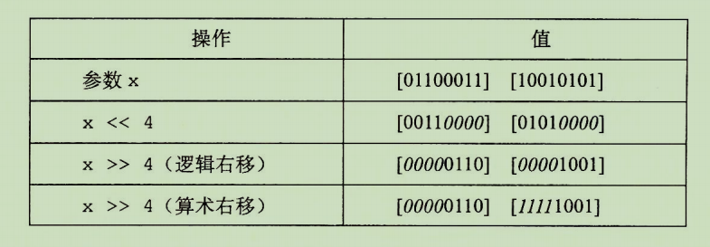

## 信息存储

多数计算机使用 8 位的块或者字节（byte），作为最小的可寻址的内存单位，而不是访问内存中单独的位。机器级程序将内存视为一个非常大的字节数组，称为虚拟内存（virtual memory）。内存的每个字节都由一个唯一的数字来标识，称它为地址（address），所有可能的地址集合就称为虚拟地址空间（virtial address space）。虚拟地址空间只是一个展现给机器级程序的概念性映像。实际的实现是将动态随机访问存储器（DRAM）、闪存、磁盘、特殊硬件和操作系统软件结合起来，为程序提供一个看上去统一的字节数组。

## C 语言中的移位运算

移位运算示例：



逻辑右移，从左端补零。

算术右移情况特别，会根据最高位的值，从左补零。如，最高位是 1，则从左补 1。

C 语言标准没有明确定义对于有符号数应该使用哪种类型的右移，算数右移或逻辑右移都可以，虽然没有定义，但几乎所有的编译器或机器组合都对有符号数使用算术右移。对于无符号数，右移必须是逻辑右移。

根据 2 的幂转换成 16 进制的规则

| 幂（n） | 公式    | 16进制   |
| ------- | ------- | -------- |
| 9       | $1+4*2$ | 0x200    |
| 19      | $3+4*4$ | 0x80000  |
| 21      | $1+4*5$ | 0x200000 |
| 16      | $0+4*4$ | 0x10000  |

**转换规则是：将幂数除以4，商是2的幂，值为 16 进制的 0 的个数**

## 字数据大小

每台计算机都有一个字长（word size），指明指针数据的标称大小。因为虚拟地址是以这样的一个字来编码的，所以字长决定的最重要的系统参数就是虚拟地址空间的最大大小，对于一个字长为 w 位的机器而言，虚拟地址范围为 $0~2^w-1$ 字节。

## 布尔代数

布尔运算也遵循分配律：
$$
a\&(b|c) = (a\&b)|(a\&c) \\
a|(b\&c) = (a|b)\&(a|c)
$$

#### 有符号数和无符号数之间的转换

根据类型的位数进行转换：

```c
short int v = -12345; // 如这个 short int 有 32 位
// 转换成一个无符号的 short
unsigned short uv = (unsigned short) v; // uv = 53191
// 转换规则是 2^32 - 12345
```

