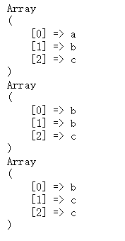

### 引用

```php
$data = ['a','b','c'];
foreach($data as $k => $v) {
    $v = &$data[$k];
    print_r($data);
}
```

每次 `$data` 循环值



因为第一次循环 $v 的指向是 $data[0]，第二次的指向是 $data[1]，因为第一次 $data[0] 也是被 $v 指向了，所以在第二次修改的时候，$data[0] 的值也被修改了，后面同理

### 数据类型

```php
echo (0.1 + 0.7) == 0.8 ? '真' : '假'; // 假
```

因为计算机的运算是将数字转为二进制来运算，PHP 浮点数转为二进制会有精度丢失的，因此不为真，浮点数的运算可以采用 BCMath 扩展

### 正则表达式

分隔符：正斜线 / 、hash 符号 # 、取反符号 ~

模式修正符：

- i 不区分大小写
- m 多行匹配
- s 使 `.` 能匹配任何字符
- x 表达式中的空白字符将被忽略，除非它已经被转义

```php
$s = <<<'TEXT'

TEXT;
 
preg_match_all('//',$s,$m); // 此处的正则表达式有一个空白符，如果加入了 x 则不能匹配到任何东西，除非将这个空白符转义
```

- A 从字符串的开头开始搜索

```php
$s = <<<'TEXT'
bcd
TEXT;
 
preg_match('/b/A',$s,$m); // 可以匹配到，如果是 cbd 则匹配不到
```

- U 非贪婪匹配，一般可以在元字符后面跟一个 `?` 这样也是非贪婪匹配
- u 使用 unicode 匹配字符集，模式和目标字符串被认为是 utf-8
  - x4e00 - x9fa5 中文编码范围
  - x3130 - x318F 韩文
  - xAC00 - xD7A3 韩文
  - x0800 - x4e00 日文

后向引用：重复搜索前面某个分组匹配的文本，\1 代表分组 1 匹配的文本 `([\d]+)\1`

### 会话控制技术

##### cookie：

优点：

- 存储在客户端不占用服务器资源

缺点：

- 因为保存在客户端不能保存一些敏感信息

##### session

session 是基于 cookie 的，因为 sessionID 是存在 cookie的 ，如果客户端禁用了 cookie 则可以使用传参的方式获取

### CGI、FastCGI 和 PHP-FPM 区别

CGI：每次一个请求都会创建一个进程，用于执行PHP解析器，执行完毕后再 kill

FastCGI：执行完一个进程后不会 kill 掉这个进程，而会继续处理其他请求

PHP-FPM：maste 进程负责接收请求并分发请求给worker，worker 进程管理处理请求

### mysql

#### InnoDB

默认事务引擎，数据存储在共享表空间，可以通过配置分开

对主键查询的性能高于其他类型的存储引擎

内部做了优化，从磁盘读取数据时自动在内存构建 hash 索引

插入数据时自动构建插入缓冲区

支持热备份，支持崩溃后的安全恢复

支持行级锁，支持外键

#### MyISAM

拥有全文索引、压缩、空间函数

不支持事务和行级锁，不支持崩溃后的安全恢复

表存储在两个文件，MYD和MYI

设计简单，某些场景下性能较好

### 索引考点

##### 索引对性能的影响：

- 减少服务器需要扫描数据量
- 帮助服务器避免排序和临时表
- 将随机 `I/O` 变为顺序 `I/O`
- 提高查询速度，降低写的速度、占用磁盘空间

##### 索引类型

普通索引：最基本的索引，没有任何约束限制

唯一索引：与普通索引类似，具有唯一性约束

主键索引：特殊的唯一索引，不允许有空值

 组合索引：将多个列组合在一起创建索引，可以覆盖多个列

外键索引：只有 InnoDB 才可以使用外键索引，保证数据一致性、完整性实现级联操作

全文索引

### MySQL 的 SQL语句编写

##### 关联更新：

```mysql
//方法一 关联更新 a b表，可以使用逗号隔开
update a,b set a.c1 = b.c1,a.c2 = b.c2 where a.id = b.id;
// 方法二 使用 inner join
update a inner join b on a.id = b.id set a.c1 = b.c1,a.c2 = b.c2 where ....
```

##### 关联查询

交叉连接（cross join）

内连接（inner join）

外连接（left join/  right join）

联合查询（union 和 union all）：

将多个结果集集中在一起，union 前的结果为基准，联合查询的列数要相等，相同的记录行会合并，union all 不会合并重复的行

全连接（full join）

### MySQL 查询优化


### MySQL 分区表 分库表

##### 分区表：

分区表是一个独立的逻辑表，MySQL 将其分成了多个物理子表，每一个分区表都会使用一个独立的表文件，不会影响客户端代码，创建表时 partition by 子句定义每个分区存放的数据，执行查询时，优化器会根据分区定义过滤那些没有我们需要数据的分区，这样查询只需要查询所需数据在的分区

##### 分库分表：

通过一些 hash 算法或者工具实现将一张数据表垂直或者水平进行物理切分

### PHP 框架的差异和优缺点

##### Yaf：

优点：

使用 PHP 扩展形式写的PHP框架，以 C 语言为底层编写，性能上比用PHP代码写的框架要快，执行效率高，轻量级框架，可扩展性高

缺点：

高版本兼容性差，底层代码可读性差，需要安装扩展，功能单一开发需要编写大量的插件

### 高并发

**QPS：每秒钟请求或者查询的数量，在互联网领域，指每秒响应请求数（指HTTP请求），不等于并发连接数** 

**PV：综合浏览量，即页面浏览量或者点击量，一个访客在 24 小时内访问的页面数量，同一个人浏览同一个页面，只记一个 PV**

**UV：独立访客，即一定时间范围内相同访客多次访问网站，只计算为1个独立访客**

**带宽：计算带宽大小需要关注两个指标，峰值流量和页面的平均大小**

**日网站带宽 = PV / 统计时间（换算到秒） * 平均页面大小（单位 KB）* 8**

**峰值每秒请求数（QPS） = （总PV数 * 80%）/ （6小时秒数 * 20%）**：表示 80% 的访问量集中在 20% 时间内

##### 流量优化：

防盗链处理

##### 前端优化：

减少 HTTP 请求、添加异步请求、启用浏览器缓存、文件压缩、CDN加速、建立独立的图片服务器

##### 服务端优化：

页面静态化、并发处理、队列处理

##### 数据库优化：

数据缓存、分库分表、分区操作、读写分离、负载均衡

##### web 服务器优化：

负载均衡


#### 防盗链

##### 处理方式：

通过 Referer 或者签名，网站可以检测目标网页访问的来源网页，如果是资源文件，则可以跟踪到显示它的网页地址，一旦检测到来源不是本站即进行阻止或者返回指定的页面

##### Referer：

nginx 模块 ngx_http_referer_module 用于阻挡来源非法的域名请求

##### 加密签名：

使用第三方模块 HttpAccessKeyModule 实现 Nginx 防盗链

accesskey on|off 模块开关

accesskey_hashmethod md5|sha-1 签名加密方式

accesskey_arg GET 参数名称

accesskey_signature 加密规则

#### 减少 HTTP 请求


